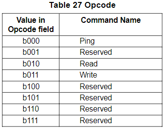

Frame Structure and Control Word
=======

Mapping Bitstream to Frames
-------

建議直接看下面的 Figure 22 來理解什麼是 Bitstream 會比較快。

Frame Shape
-------

Frame 的行數與列數可以自行設定，如 Table 23/24 所示。Frame Row 數量的範圍是 `48~256` 列、Column 數量的範圍是 `2~16` 行。

從上表可以看到，Row 數量共有 23 種設定值、Column 數量共有 8 種設定值，因此排列組合起來共有 `23x8=184` 種不同的 frame shapes；Frame Size 則是從最小 `48 x 2 = 96 (bits)` 到最大 `256 x 16 = 4096 (bits)`。

BitSlot 的位置可以用符號 `[<Row>, <Column>]` 來進行分辨，frame 的第一個 bit 為 `[0, 0]`，接下來為 `[0, 1]`, `[0, 2]`, ..., `[1, MaxCol]`, ..., `[MaxRow, 0]`, `[MaxRow, 1]`, ..., `[MaxRow, MaxCol]`。Figure 22 展示了同一組 BitSlots 的 Frame view 和 Bitstream view：

Frame shape 的設定會跟 bus clock 以及該 audio streams 的 audio sample rate 有關，以下舉兩個例子：
- 48kHz sample rate & 12.288MHz bus clock
  - $\frac{12.288MHz \times 2}{48KHz}=512(bits)$；這是由於 SoundWire 一個 clock cycle 可帶 2 bits data
  - 因此 frame shape 需要與 512 相關，例如：`64 x M`, `128 x M`, `256 x M`；其中 `M` 為 Column 數量
- 48kHz sample rate & 9.6MHz bus clock
  - $\frac{9.6MHz \times 2}{48KHz}=400(bits)$
  - 因此 frame shape 需要與 400 相關，例如：`50 x M`, `100 x M`, `200 x M`

Control Word
-------

在 Frame Structure 中，第一行 (`column 0`) 的前 48 個 bitslots 即為 Control Word，如 Figure 23 所示，而除了 column 0 以外的其他行都是 data payload。但由於 bitstream 會將 Frame 一列一列傳輸，因此從 Figure 22 你會看到 Control Word 在 bitstream 中是不連續的。

- 48 bits 的 Control Word 中又用被分成了兩種功能
  - Control BitSlot (20 bits) : 負責一些 low level 的功能，例如 Frame Synchronization。如下 Table 25。
  - Command BitSlot (28 bits) : 負責幫助當前的 command owner 傳送 command 給其他設備，也負責接收 respond 給 command owner
 

Control Word Fields
-------

#### PREQ (Ping Request) ####

這是由一個或多個 Slave 發出來的 Alert，用於請求 Comannd Owner 發送 Ping Frame 來讀取 Peripheral 當前的狀態資訊。此外，由於多個 Slave 的 data line 是 `Wire-OR` 關係，所以只有有其中一個 Slave 拉起 PREQ，Command Owner 收到的 PREQ 都會被拉起來。

而當 Command Owner 收到該 PREQ 後，會在接下來的 32 個 Frame 內發送 Ping Command 去讀取 Slave 狀態。一旦拉起了 PREQ，Slave 就會一直拉著直到成功收到來自 Owner 的 Ping Command。

#### Opcode ####

Opcode 由 3 bits 組成，目前 SoundWire 定義的 Opcode 有以下三種，如 Table 27：

- Ping : 讓 Bus 上所有 Slave 都回傳狀態
- Write : Commmand Owner 對一個或多個設備中的一個或多個 Register 寫一個 8 bits data
- Read : Commmand Owner 從一個或多個設備中的一個或多個 Register 讀一個 8 bits data

#### Static Synchronization ####

#### PHY Synchronization ####

#### Dynamic Synchronization ####