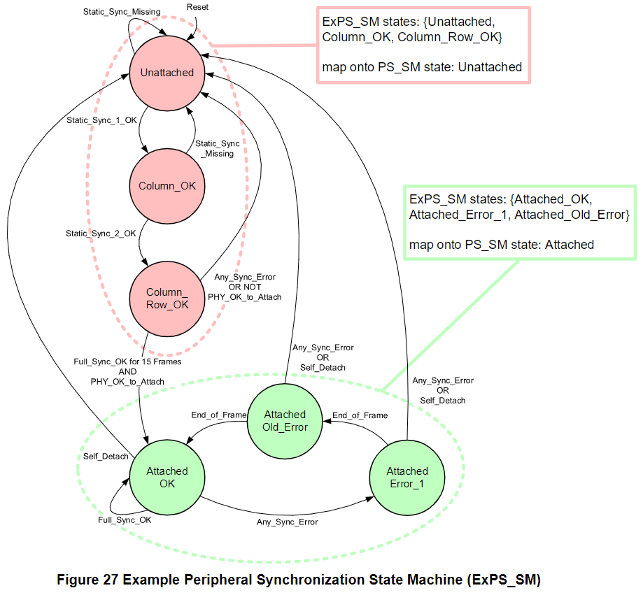
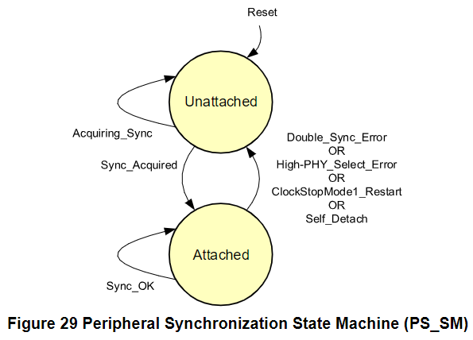

Frame Synchronization
=======

Manager Initialization
-------

Master 一開始會先發一段時間的 clock 再進到初始化階段，以發出 Static/Dynamic Synchronization，Slave 需要去匹配所有的同步碼來跟 Master 進行同步。為了讓 Slave 可以盡快跟 Master 完成同步，所以在列舉 (Enumeration) 完成前，Master 發的 Frame 之 Frame Shap 會是 48 列 2 行的格式 (因為這時 Control Word 佔整個 Frame 的比例最大)，讓相同的時間可以送出更多的 Command，而當完成列舉後 Master 就可以去自行根據應用去更改 Frame Shape。

Peripheral Synchronization Process
-------

Peripheral Synchronization 的過程被總結在 Figure 27 的 Peripheral Synchronization State Machine (PS_SM) 裡。在這個 State Machine 可以看到 peripheral 被 attach 到 bus 或從 bus 上 unattach 的概念。我們可以從 Figure 27 清楚了解到 slave 是如何跟 master 進行同步的，以及 slave 同步失敗時的狀況。

另外，從 Figure 27 也會看到還須對設備進行 High-PHY mode 的檢測，Master 會等所有 slave 都具備 High-PHY 功能時，才可以進入 High-PHY mode。

在進入 `Attached_OK` 狀態前，需要先匹配 Static Synchronization，接著再匹配連續 15 個 Frame 的 Dynamic Synchronization 後才可以進入 `Attached_OK` 狀態。倘若在 attached 狀態下**連續兩個 Frame 發生** `Any_Sync_Error` 則會回到 `Unattached` 狀態。

順利到 `Attached_OK` 狀態之後還需要先進行裝置列舉，賦予每個裝置 Device Number (範圍是 1 ~ 11)，列舉完後就可以開始進行通訊了。

Figure 29 是簡化的 Peripheral Synchronization State Machine (PS_SM)：

