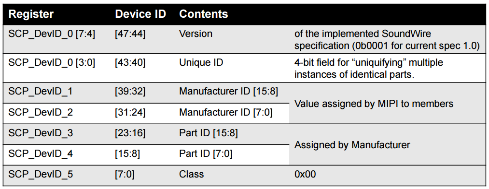
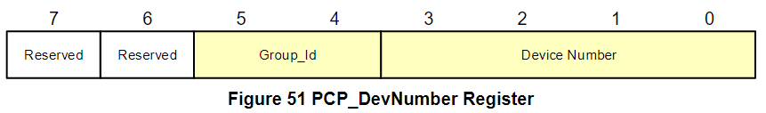
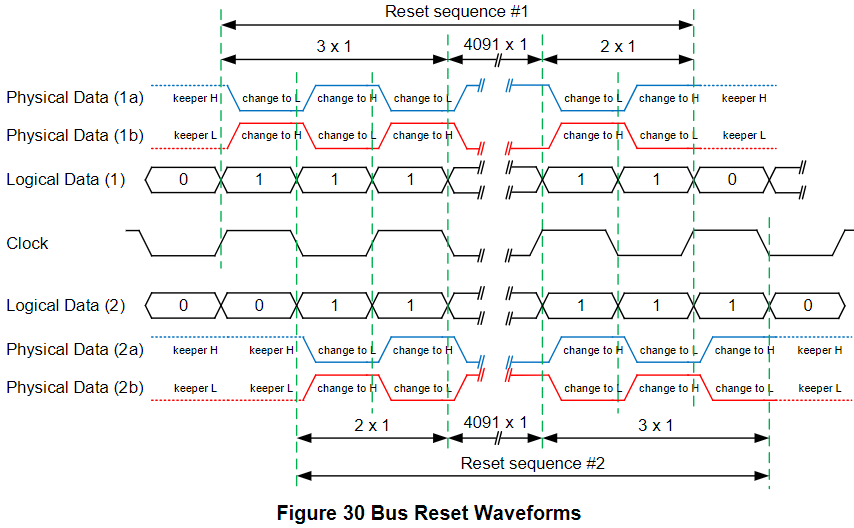
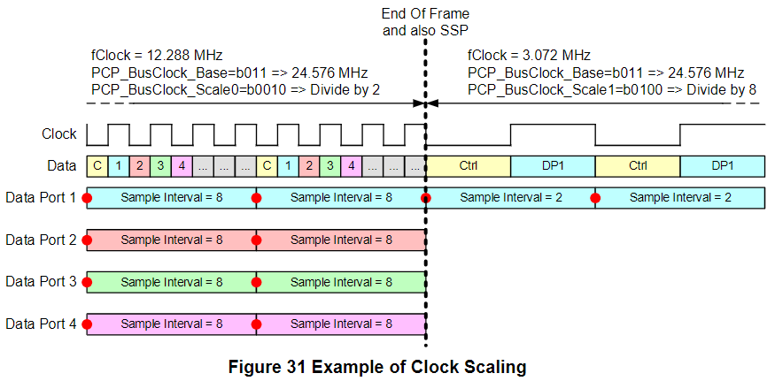

System Control
=======

本章節主要在介紹 SoundWire 的底層功能，包括 Enumeration, Resets, Clocks, Data Drive Collision, PHYs Selection 等。

Enumeration
-------

Master 在進行正常的數據傳輸前，其辨識和初始化 bus 上的 Device 的過程就稱為列舉 (Enumeration)。以下以逐條方式敘述多個裝置列舉的過程：

- 當多個 Slave 剛連上 Bus 時，都會被當作第 0 號設備 (Device Number 0)
- 接下來 Master 會發出 PING，所有的 Slave 都會把狀態回應在 Control Word 的 `Slave 0 Status` (bit 39 & 40)
- 多個 Slave 回應的 Slave 0 Status 會在 bus 上 wire-OR (出現 Logic 1 時則會讓 data line 電位轉換)
- 一旦 Master 看到 data line 電位轉換，它就會開始做 Enumeration
- 首先，Master 會用 Read Command 讀 Device_ID Register 的第一個 byte (`SCP_DevID_0`)，bus 上所有的 Slave 都會收到該 Read Command
- 所有的 Slave 會在 bus 上回應自己的 `SCP_DevID_0` Value，這些 Value 同樣會在 bus 上做 wire-OR，一旦有 Slave 發現它寫在 bus 上的 Value 與它讀回來看到的不一樣則會退出列舉，直到下次又有 Master 來 Read `SCP_DevID_0`
    - 假如自己是一個 Slave，如果別的 Slave 的 Logic 1 覆蓋掉自己的 Logic 0，此時自己就會檢測到 bus contension 而停止此次列舉過程，直到下次又有 Master 來 Read `SCP_DevID_0`
- Device_ID Register 共有 6 bytes (`SCP_DevID_0` to `SCP_DevID_5`)，Master 會依照順序從 `SCP_DevID_0` 讀到 `SCP_DevID_5`，讀到最後應會剩下最後一個 Slave，就賦予該 Slave 新的且唯一的 Device Number (1~11)
    - 可以參考 Figure 51，Master 除了賦予 Slave Device Number (1~11) 以外，還會給一個 `Group_Id` (1~2)。未來 Master 可以利用 Group_Id 同時 access 多個同群組的 Slave
- 接下來 Master 會重複上面三個步驟直到所有 Slave 都賦予新的 Device Number
- 列舉流程結束

下圖就是每個裝置都會有的 DeviceID Register，共 6 bytes (48 bits)：

#### PCP_DevNumber Register ####

`PCP_DevNumber` Register 位於 Device 的 Address `0x0046`

- Group_Id
    - 1 : Group 1
    - 2 : Group 2
- Device Number
    - 1 ~ 11 : Bus 上每個 Slave 唯一的 Device Number
    - 12, 13 : 12 代表 Group 1；13 代表 Group 2，讓 Master 可以一次 Acceess 多個同群組的 Slave
    - 14 : 保留給 Master
    - 15 : 指 Bus 上所有的 Device（Broadcast Access Mode），用於一次 access 所有 Device

Resets
-------

SoundWire 有三種 reset 都會讓 device 狀態轉為 unattached，從而需要重新 attached 到 bus 來等待列舉 (enumeration)，下面根據對系統的影響從小排到大，這三種 reset 分別是：

1. Soft Reset
    - Soft Reset 一般發生在設備發生同步錯誤的時候，當設備同步碼出現太多錯誤 bit 時就會發出 Soft Reset，這種 reset 對設備的影響最小，僅僅是用來防止設備在錯誤的時間往 bus 發送數據。當設備重新 attach 上 bus 後並且完成列舉之後，Master 就可以讀取設備的 register 來進行 debug。

2. Hard Reset
    - 當發生 `clock stop` 或是往 SCP_Ctrl Register 寫 `ForceReset` 時就會觸發 Hard Reset。Hard Reset 會對 Slave 內部多個(或全部)狀態有影響，影響程度取決於 designer 怎麼設計。

3. Severe Reset
    - 對設備影響最大的就是 Severe Reset，例如發生 POR 或 Bus Reset 時，其影響範圍也涵蓋了 Hard Reset 影響的部分。甚至是一些從初始化之後就不會更改的部分 (例如 PHY Output Control) 也會被 Severe Reset 影響到。

#### Bus Reset ####

如 Figure 30 所示，如果設備連續接收了超過 4096 個 Logic 1 時 (也就是 2048 個 clock cycle)，此時就會在第 4096 個 Logic 1 時觸發 Bus Reset。而之後只要保持發送 Logic 1，則設備就會一直 keep 在 reset 狀態。

Clock
-------

#### Clock Generation ####

Master 通過產生 clock 來實現數據傳輸。

#### Clock Scaling ####

Master 可以動態調整 Clock Frequncy，以增加傳輸效率或節省功耗。Figure 31 示範了 Master 是如何在還有 audio payload 在傳輸的期間改變 clock frequency。(在該例子中，Master 在配置 Bank Switch Command 之前就已經配置了一系列的 Register 了，當 Frame 結束時就馬上切換成需要的 Clock Rate)

- 解釋 Figure 31 的動作：
    - Master 將 Clock 從 12.288MHz 修改為 3.072MHz
    - 上述在 CurrentBank 的修改讓當前的 `ClockScale` 值從 b'010 (divide-by-2) 變更為 b'100 (divide-by-8)
    - Master 將 Frame Shape 的 Column 數從 8 修改為 2
    - 上述在 CurrentBank 的修改讓當前 Data Port 1 的 `Sample Interval` 值從 8 變更為 2
    - 上述在 CurrentBank 的修改讓 Data Port 2, 3, 4 停止了 payload 傳輸

#### Clock Pause ####

Clock Pause 是指 Master 不通過任何通知或預警，可以在任意時候直接暫停 Clock，使 Clock 暫時停在高電平或低電平一段時間。Clock Pause 只能由 Master 來執行，並且這個動作會打亂 Slave 接收 Frame 的過程，因此 Clock Pause 一般都用在沒有 active channel 的時候 (例如只做 Ping, Read/Write 時)。而 Clock Pause 與下面的 Clock Stopping 的相異之處在於 Clock Stopping 可以無縫恢復傳輸。