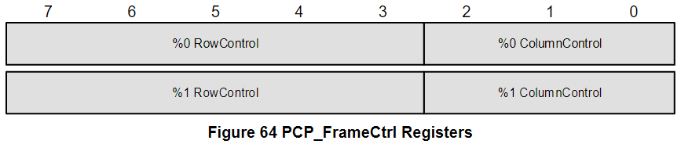
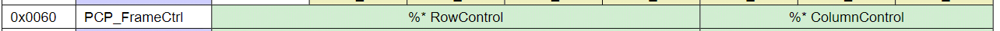
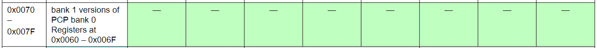
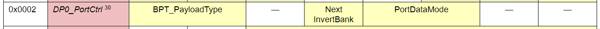
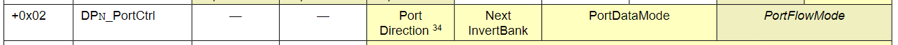

Commands
======

Commands 是 Control Word 的一部分，其包含了 Ping, Read, Write 操作。

Register Bank Switching
-------

可以先配置好一系列的參數 for 特定的 bank (bank 0 or 1)，切換 bank 之後就可以在下一個 Frame 就馬上套用所有參數 (其中包含 Frame Shape)

#### Bank Selection ####

對 PCP_FrameCtrl0 (0x0060) 寫值就會切換到 Bank0；對 PCP_FrameCtrl1 (0x0070) 寫值就會切換到 Bank1。切換到新的 Bank 後，其所有新的參數設定 (包含 Frame Shape 和 Data Port Registers) 會在下一個 Frame 開始採用。

#### Frame Shape Change ####

Device Register `SCP_FrameCtrl` 用來存放 Frame Shape 的 Row/Column 資訊，如 Figure 64：

- 記憶體位址
    - `0x0060` : PCP_FrameCtrl0 Register (for bank 0)
    - `0x0070` : PCP_FrameCtrl1 Register (for bank 1)

> Master 可能會在列舉後用 Device Number 12, 13, 15 快速設定所有 Slave 的 Frame Shape。

#### CurrentBank_DPx and NextInvertBank ####

每個 Data Port 都有自己的 CurrentBank 狀態，稱為 `CurrentBank_DPx`。這個狀態只會影響到自身 Data Port 的傳輸，並不會影響到整個 Slave 的傳輸 (例如 FrameStructure)。

如下圖所示，每個 Data Port 的 `0x0002` `DP_PortCtrl` 裡面的 `Next InvertBank` 欄位可以單獨讓該 Data Port 在下一個 Frame 切換到另一個 Bank 的設定。

Stream Synchronization Points (SSPs)
=======

不同的 data port 可能會用不同的 sample interval 在運作，但如果有個 Point 是所有 data port counter 都為 0，那就代表雖然每個 data port 的 sample interval 都不一樣大小，但他們有一個最小公倍數。

SoundWire 有個機制可以指定特定的 clock edge，該 edge 就是 Stream Synchronization Points (SSPs)，在 SSP 時所有的 sample interval counters 都會強制設為 0，並且強制每個 sample interval 都要同相。

SSPs 之間的 interval 大小為所有目前正在使用之 sample interval 的整數倍。因此一旦 sample interval counter 被一個 SSP 強制歸零，它就會永遠為 0 了，再次強制清零的操作就不會擾亂其計數週期。

- Master 有以下兩種方式可以產生 SSP，
    - 使用 Ping Control Word，並且將 SSP bit (bit 5) 設成 1
    - 存取 `SCP_FrameCtrl0` or `SCP_FrameCtrl1` Register

Payload 的傳輸和取樣是通過 Data Port 內部的 Counter 通過測量 bitslot interval 來進行的。為了保證傳輸的正確性，傳輸端與接收端的 Data Port 兩端的 Counter 必須要同步，此時就需要 SSP 的幫忙了。SSP 一般出現在 Frame 的邊界。例如上一個 Frame 結束時 (BitSlot[MaxRol, MaxCol]) 或下一個 Frame 開始時 (BitSlot[0, 0])