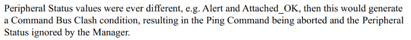
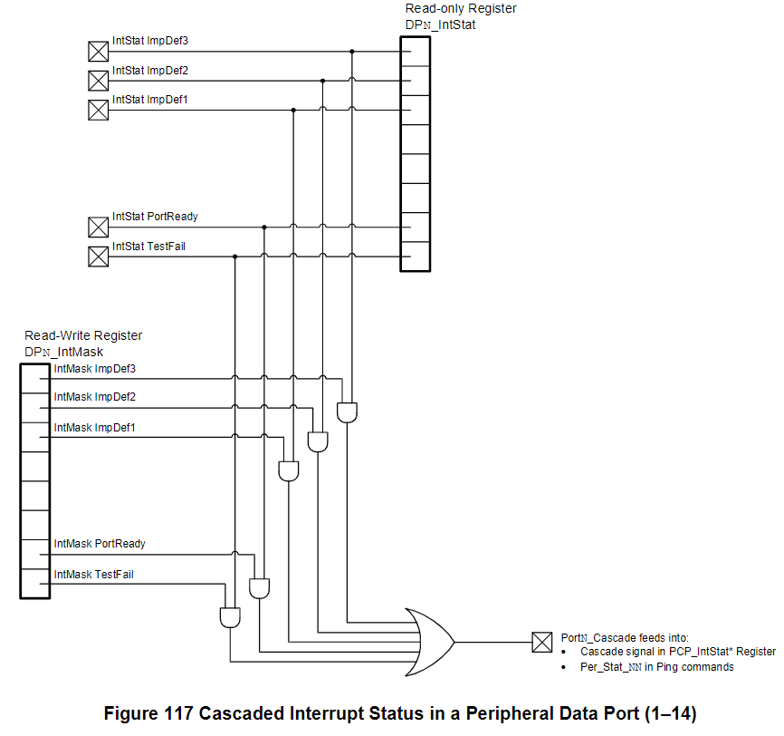
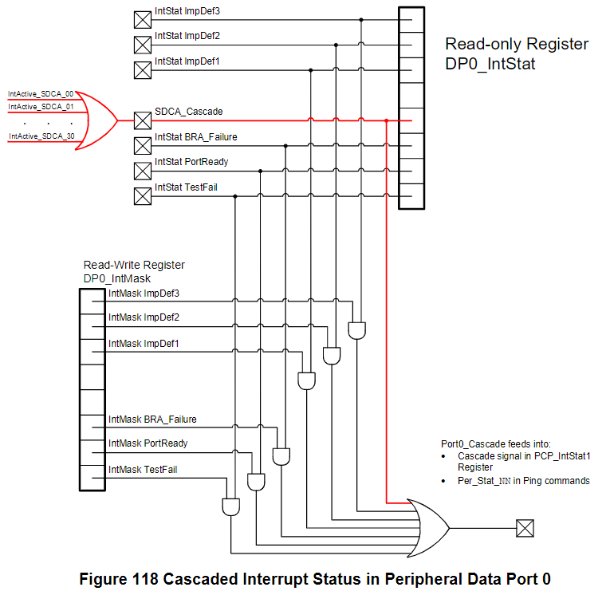
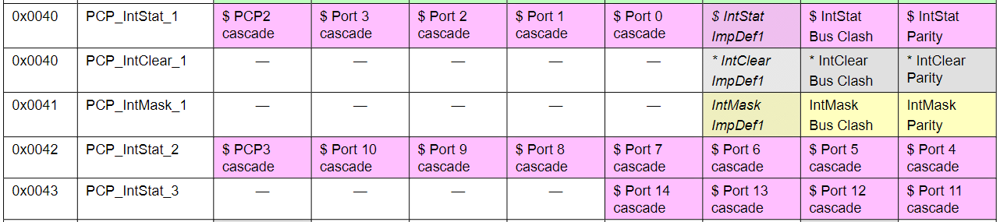
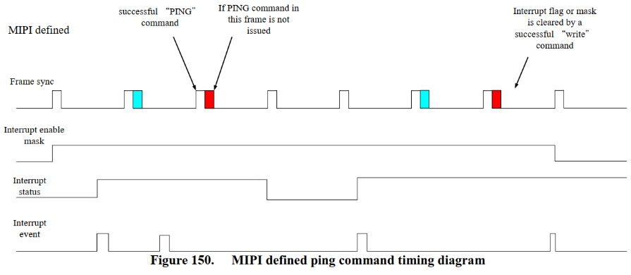

Interrupts
=======

Interrupt 流程
-------

1. New Event : Peripheral 有未處理的 Interrupt
2. Peripheral assert PREQ in Command Field
3. Manager 看到 PREQ，並發出 Ping Command 蒐集所有 Peripheral 的 Per_Stat_NN

當 Peripheral 已經因為有新的 Alert 發出 PREQ，後續就不會在發了。除非從 ClockStopMode0 重新回到 Attached 才會再發第二次 PREQ

4. Manager 詢問有 Alert status 的 Peripheral (速度由 System defined，自行定義優先順序)
5. Manager 讀取 PCP_IntStat 來確認有哪些 Actived & Enabled Int (找出哪個 DP 有 Interrupt)
6. Manager 讀取有 Interrupt 之 DP 的 DPx_IntStat  (速度由 System defined，自行定義優先順序)

注意 DPx_IntStat 若沒有經過 IntMask (IntState & IntMask!=1)，讀取者須要自行處理

7. Manager 處理對應的 IntStat signal (System defined 自訂優先順序)
8. Manager 處理好對應的 IntStat signal，並且將 DPx_IntClear 寫入 1，以清除對應 Interrupt
9. 回到 Step6，依序清除該 Data Port 的每個 Interrupt，直到該 DP Interrupt 皆清除
10. 回到 Step5，確認還有哪些 Data Port 有 Interrupt，直到所有 DP Interrupt 皆清除
11. 回到 Step2，確認還有哪些 Peripheral 還有 Alert，並繼續處理 Interrupt 直到所有 Peripheral 皆沒有 Interrupt

- Note
    - 需特別注意，DataPort0 額外多了 SDCA_Cascade Interrupt
    - 列舉前不建議打開 Interrupt (Mask)
        - 不可有效的讀取，因為可能有多個 Peripheral 同時回應
        - 不可有效的發出 Interrupt alert
    - PortN Cascade 皆有經過 Mask，而 DPn_IntStat 未經過 Mask

下圖為 Interrupt Stat bit 的繼承關係，如下：
- PCP3 cascade bit = (Port14 cascade) OR (Port13 cascade) …  OR (Port11 cascade)
- PCP2 cascade bit = (PCP3 cascade) OR (Port10 cascade) …  OR (Port4 cascade)
- PCP1 cascade bit = (PCP2 cascade) OR (Port3 cascade) …  OR (Port0 cascade)

