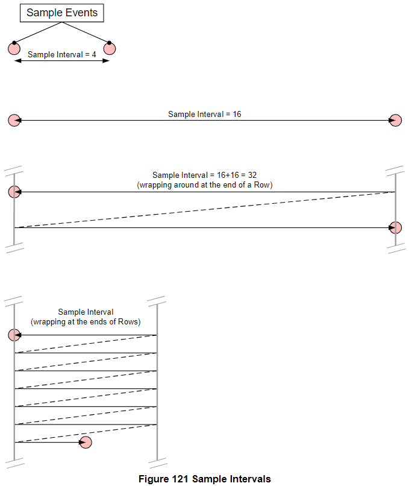
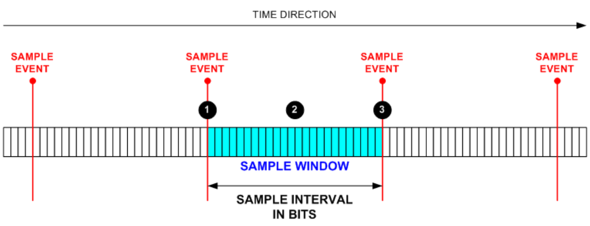
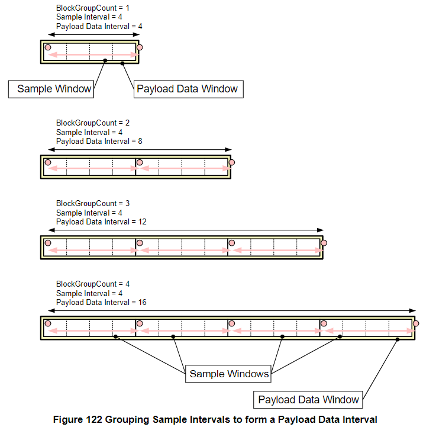
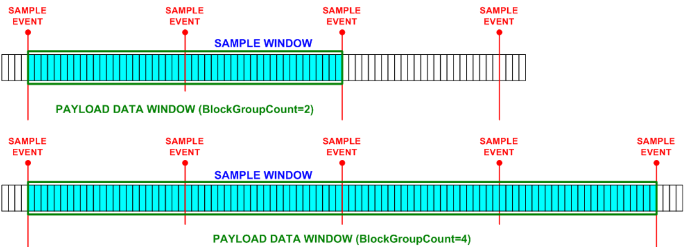
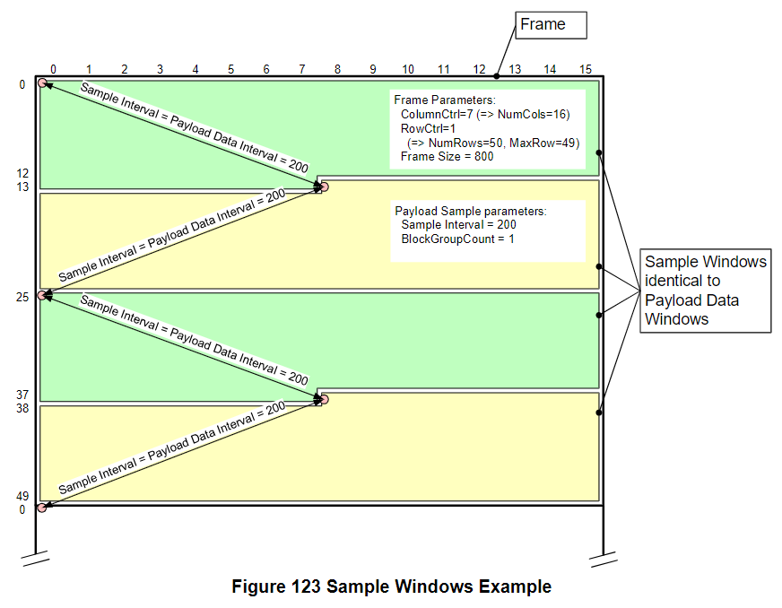
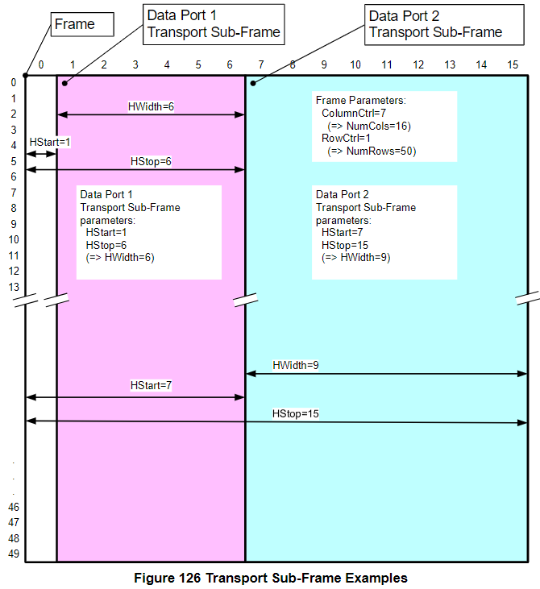
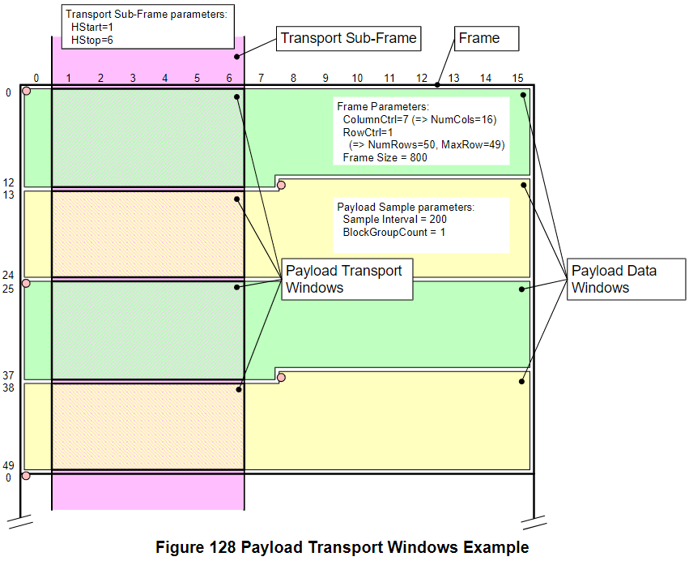
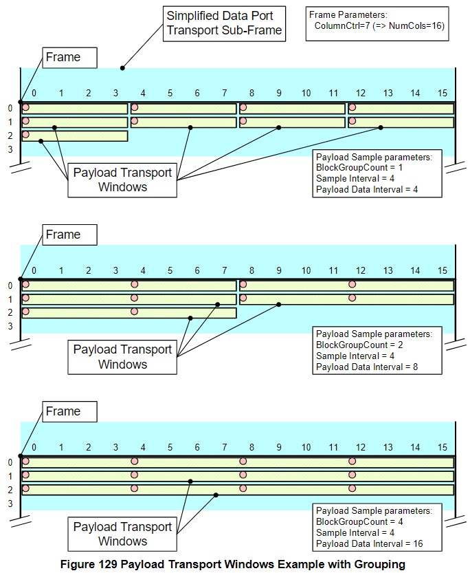
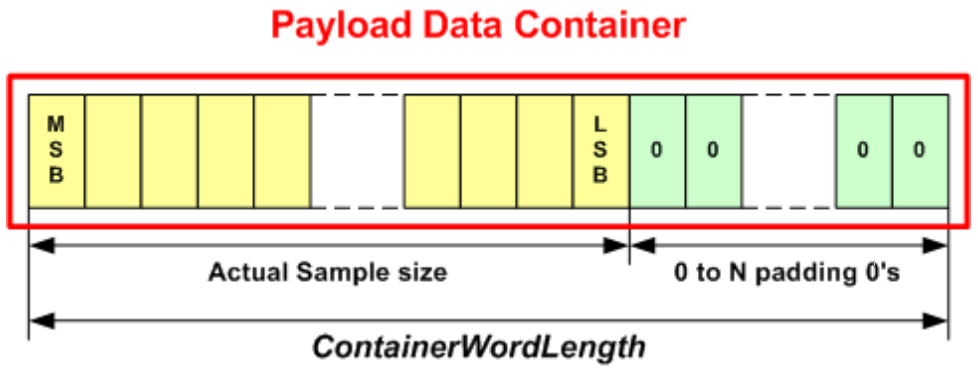

Payload Transport
=======

本章節會說明 SoundWire Data Ports 是如何傳輸 payload data，一般的 payload stream 就是一個 Sample Data 的序列，例如 audio payload。而 Payload Stream 會由一個 Data Port 發出，然後可以被多個 Data Ports 接收。

之後後面還會提到 Bulk Payload Transport (BPT)，BPT 可以用於傳輸大量的 Register Configuration，會比用 SoundWire Control Word 來配置 Slave 還要有效率。

> BPT 一般都是由 Control Port 0 來發送。

一般的設備的 **Data Port 編號是從 1 ~ 14**，這個編號可用來辨識 Register 是想要控制哪個 Data Port。而**每個 Data Port 中的 Channel 編號則是從 1 ~ 8**，每一個 channel 會同時傳輸一個 payload stream。

你可能會好奇把多個 channel 塞在一個 data port 裡面的意義是什麼，它的目的其實就是為了讓這些 channel 可以用相同的傳輸參數 (包含 Sample Rate, Sample bit width 等) 來進行傳輸。

Sample Event, Sample Intervals and Sample Windows
-------

- `Sample Event`
    - 指的是開始取樣的時間點
    - Sample Event 是由 Data Port 產生的，因為 SoundWire Spec 並沒有定義 Sample Event 要什麼時後發生，只要能正常傳輸音訊就好
- `Sample Interval`
    - 就是兩個 Sample Event 之間傳輸的 bits 數量
    - 為了讓每一個 Frame 裡面都包含整數個 Sample Interval，所以通常 Frame Shape 的大小要是 Sample Interval 的整數倍 (但其實沒有整數倍也可以 Work)
- `Sample Window`
    - 兩個 Sample Events 之間的 bitslots 集合又稱為 Sample Window

Figure 121 為 Sample Events 與 Sample Intervals 的概念圖：

Payload Data Window
-------

SoundWire 允許將最多 4 個 Sample Windows 組在一起，形成一個 `Payload Data Window`，而整個 Payload Data Window 裡面的 Bitslots 數量又稱為 `Payload Data Interval`。可以參考 Figure 122：

- Payload Data Window 裡面可以有 1 ~ 4 個 Sample Windows
- 可以用 `BlockGroupCount` 參數來設定

下圖 Figure 123 則是一個 `BlockGroupCount=1` (Payload Data Window 與 Sample Window 的大小一樣) 的範例，其 Frame Shape 共 800 bits，可以容下四個 Payload Data Interval 為 200 bits 的 Payload Data Window。

> Payload Data Window 可以是任意的大小。

Transport Sub-Frame
-------

Sub-Frame 其實只是一個抽象的概念，data port 會將它用在 Frame 中，以區分哪個 bitslot 屬於哪個 stream。

Figure 126 為一個 Frame 中有兩個 Data Port Sub-Frame 的例子，其中 `HStop` 就等於 Sub-Frame 的行數。要注意多個 Sub-Frame 區塊不能相互覆蓋。一個 Sub-Frame 內的 Bitslots 就是某一個 Data Port 可能要傳輸的數據。

> 每個 Data Port 配置的 Transport Sub-Frame 大小都可以不一樣。

Payload Transport Window
-------

簡單來說 Payload Transport Window 就是 Payload Data Window 與 Transport Sub-Frame 的交集區域。Data Port 也會用 Payload Transport Window 來區分哪個 bitslot 屬於哪個 stream。

Figure 128 是 Payload Transport Window 的示意圖：

Figure 129 是 Payload Transport Window 在相同 Sample Interval 的情況下，不同 BlockGroupCount 的示意圖：

Payload Data Container
-------

Payload Data Container 是 **channel 傳輸 data 的基本單位**，`ContainerWordLength` 參數會決定了 Payload Data Container 的長度，如下圖所示，前段會放取樣數據，而後段沒放數據的部分則填充 0，並且是先傳 MSB 再傳 LSB：

> 每個 Payload Data Container 都對應了一個 channel。

Payload Data Block
-------

