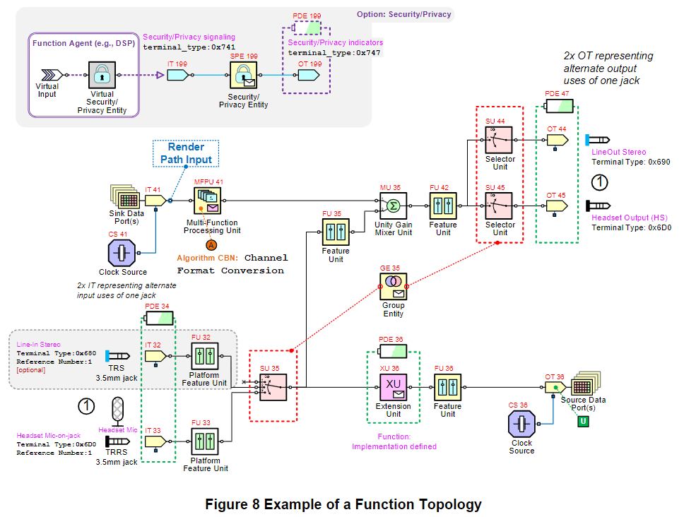

Overview
=======

Features
-------

- 將 Software Interface 進行標準化，讓我們得以透過軟體來控制音訊相關功能
- 工程師可以用 Software/Firmware 來控制 Audio Components
- 用 SDCA 這套標準 Class Driver Software 就可以做到啟動系統並且傳輸音訊，而不需要額外的 Vendor-Specific Drivers
- 為一些常用的 audio components 提供框架 (例如：Analog Jacks, Amplifiers, Microphones 等)
- SDCA 是用來補充 SoundWire or SoundWire I3S 之音訊傳輸的規格

Typical SDCA System Architectures
-------

Figure 2 例子中有多個 Peripheral 連接到 bus 上，而每個 Peripheral 都有一個或多個 SDCA Functions：

Figure 3 例子中有一個多功能的 Peripheral 連接到 bus 上，並且用三條 data lanes 來增加傳輸頻寬：

Typical SDCA Software Architectures
-------

SDCA 沒有強制規範軟體架構，但它通常會有很典型的 Function, Device, Bus 和 Controller Driver。Figure 5 為 Host Software 的範例：

Function
-------

Figure 8 為 Function Topology：

可以看到每個 Entity 都有一個編號，例如像 Figure 8 中的 **FU 32**，32 就該 Feature Unit 的 Entity ID (可以用來尋址)，範圍是 1~127，而 Disco data 裡面會存放 Entity 的  Label & ID。

每個 Entity 的 Input/Output Pin 會相互連結，如此一來 Software 就可以透過這些連結來遍歷所有 Entities 以建構出 Netlist Data Structure (可以對應 Function Topology)。

Terms
-------

- `Signal` : 輸入 Entity 或從 Entity 輸出的數據
    - 其中會包含一個或多個 Channels
- `Signal Path` : 透過 Entity 的 Input/Output Pin 將多個 Entity 連接起來的鏈路
- `Entity` : Signal Path 上具備特定功能的區塊
    - 每個 Entity 都會有 Entity ID，可以被尋址
- `Stream` : 使用 SoundWire 介面傳輸的取樣數據
- `Cluster` : 一個或多個 Channels 組成的 Signal
- `Cluster Descriptor` : 定義一個 Cluster 的 Channel 數量，每個 Channel 又會有自己的 Channel Descriptor
- `Channel Descriptor` : 描述 Channel 的三個屬性
    - `Channel_ID`, `Relationship`, `Purpose`

可以搭配 Figure 10 來看 Topology Terms：

Audio Clocking
-------

- Audio Funtion 的 Sample Rate 沒有規範，可以根據用途自行定義
- Sample Rate 由 Output Terminal 的 Clock Source Entity 決定
    - 通常 Sample Rate 會與 DP 傳輸速率相同；但在使用 Flow Control 時可能會更低
- DisCo Property 可以區分 Clock Source 是來自 local PLL/Oscillator (internal) 還是 Bus Clock (external)
- Clock Source Entity 內有 Sample Rate 清單，而 `CS:SampleRateIndex` 是用來選擇該清單內的 Sample Rate
    - 當 DP 使用 **normal isochronous transport** 時，Host Agent 會用 `CS:SampleRateIndex` 選擇與 DP 相同速率的 Sample Rate
    - 當 DP 使用 **flow-controlled transport** 時，Host Agent 會用 `CS:SampleRateIndex` 指定實際的 Sample Rate，並且用程式控制 DP 的傳輸速率

#### Sample Rates for Transducer Terminals ####

若有一個 always-on Function (ex: SmartMic)，需要它在 bus clock stop 後還可以運作，這時候會需要 IC 內部自行產生 clock，用於 always-on sampling。

SDCA Defined Function Types
-------

SDCA 有定義了一些常用的 Audio Device Function

#### Smart Amp ####

Smart Amp Function 可以驅動一個或多個 Transducers，並提供以下功能：

- 保護並避免 Speaker Transducer 損壞
- 有 Sense Stream 可以支援 Host-Resident Protection Processing
- 有 Reference Stream 可以支援 Host-Resident Acoustic Echo Cancellation
- 有 Optional Second Render Stream，其中 Ultrasound 的內容與 Human-Oriented 的 audio band 分離
- 可以產生 simple tone 來指示設備的狀態，例如開機聲等

#### Smart Mic ####

Smart Mic Function 整合了一個或多個麥克風，並提供以下功能：

- Application-specific processing (例如聲音通訊或語音辨識)
- Acoustic event detection (例如關鍵字辨識)
- 在 low-power sleep state 下時，有 History Buffer 可以先放置捕捉到的音訊數據
    - History Buffer 位在 Smart Mic Processing Unit (SMPU) 中

#### Speaker+Mic ####

Speaker+Mic 結合的 Smart Amp 和 Smart Mic，並且可以移除從 Mic 收到的 Speaker 的聲音。

#### Universal Audio Jack (UAJ) ####

UAJ Function 可以支援單個 headset 或 headphone 接上一個 4-pole TRRS 3.5mm Jack (或兩個 TRS Jacks)。

#### Retaskable Jack (RJ) ####

RJ Function 可以支援外部的 Speakers, Headphones, Microphones 接上一組 1 ~ 6 個 TRS 3.5mm Jack(s)，用以支援多聲道 (例如 5.1/7.1 聲道輸出)。

#### Human Interface Device (HID) ####

HID Function 在 SDCA HID Entity 中使用 UMP 來跟 Host 傳送或接收 HID Reports，可以用來實現在 Audio Device 上做 Volumn Up/Down。
