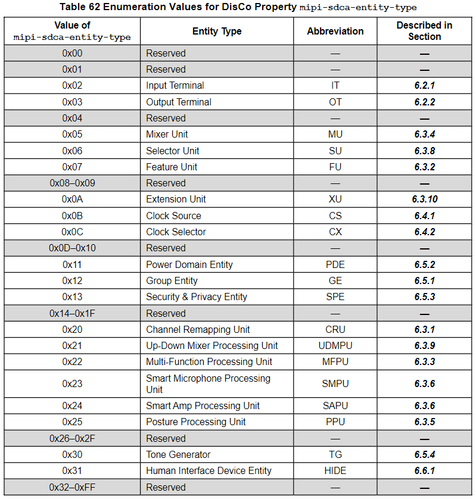

SDCA Functions
=======

Overview
-------

SDCA Functions 是個抽象概念，用來描述怎麼看到 Device 的 internal signal path 並加以控制。

- 每個 SDCA Device 最多可以有 8 個 SDCA Functions
    - 除了 `HID` 以外，其他都可以重複
    - 用 **3-bit** 的 `Function Number` 來定址 (000 to 111)

#### Funtion Type ####

可以在 `Function_Type` Control 裡面選擇要 Table 1 中的哪種 Function Type：

#### DisCo Properties ####

與 Peripheral Device 對應的 DisCo data 裡面會描述現在這個 Device 用了哪些 Functions。

- DisCo data 用了以下兩種 _ADR
    - **Peripheral Device `_ADR`**
        - 是一個 64-bit number，用來辨認 Peripheral Device
        - 對 SoundWire Spec 中一些 `DeviceID` 欄位進行編碼後得來的 (例如 `VendorID`)
    - **Function Device `_ADR`**
        - 是一個 `3-bit` `Function Number`，用來辨識 Device 裡的 Function

- Device Function DisCo Properties 包含了
    - `mipi-sdca-function-topology-features` Property
        - 是一個 64-bit bitmask，用於標識該 Function 中有哪些可選的 features
    - `mipi-sdca-entity-id-list` Property
        - 標示目前該 SDCA Function 中所有的 Entity IDs
    - 由 `mipi-sdca-cluster-id-list` Property 組成的 cluster library
        - 列出所有 ClusterIDs (還有描述每個 Cluster 的 subproperties)
    - 由 `mipi-sdca-behavior-set-id-list` Property 組成的 behavior set library
        - skip...
    - (For Functions that use Opaque Set Controls within UDMPUs) 由 `mipi-sdca-opaqueset-id-list` Property 組成的 opaque set library
        - 標識了所有 opaque sets 和 subproperties (用來描述每個 Cluster)
    - (For Functions that use UMP to download Files for AE or FDL) 由 `mipi-sdca-file-set-id-list` Property 組成的 file set library
        - skip...
    - DisCo `mipi-sdca-function-initialization-table` Property 中的 function initialization table
        - 描述了 Function Initialization 期間要執行的 byte-writes sequence

Smart Microphone Function
-------

#### Smart Mic Function Topology ####

直接看 SDCA Spec Figure 59 SmartMic Function Topology。

- 當 `External_Reference_Input=1`，則 MFPU 13/15/16/17 需要有兩個 input pin
    - 並且每個這些 MFPU 可能會做 AIR (Acoustic Interference Removal)
- 當 `External_Reference_Input=0`，則 MFPU 13/15/16/17 只需要一個 input pin
    - 此時 MFPU 13 可能不用做任何事

Table 62 列出了 Figure 59 中使用的 Entity Types：

#### Smart Mic Function Agent Topology ####

Figure 60 是與 SmartMic 相關的 Function Agent Topology：

#### Summary of Smart Mic Function Topology ####

- IT11（Terminal Type：`0x205`，Mic Array Transducer Input）將來自麥克風的 Sample Signal 饋入 SmartMic。麥克風訊號的保真度（包括內部取樣率）會受 IT11：Usage Control 的影響
- IT111 (Terminal Type：`0x18A`，Streaming Mic Sink DP) 把來自外部 SoundWire Mic 的 optional Signal 饋入 SmartMic，然後跟 CRU111 的 main Signal 混和在一起
- PPU11 選擇將哪些 mic Channels 饋送到 capture paths 和/或儲存在 SMPU history buffer 中。例如:用來適應終端設備姿勢的變化，像是合上筆電的蓋子、翻轉平板的角度

Universal Audio Jack Function (UAJ)
-------

UAJ Function 是通用的 Input/Output 拓樸，並且支援 Jack 的所有用途，可以直接看 Figure 63。

UAJ 具有 Input/Output Section，而這些 Section 的 Mode 由 GE Con​​trols 的 `Detected_Mode` 和 `Selected_Mode` 決定。

- UAJ Output Section 可以有以下用途
    - Line Output
    - Speaker Output
    - Headphone Output
    - Headset Output
- UAJ Input Section 可以有以下用途
    - Line Input
    - Mic Input
    - Headset Mic Input

> Headphone 指的是沒 Mic 的耳機、Headset 指的是有 Mic 的耳機。

當 Headset 連接到 UAJ Jack 時，UAJ 的 Output Section 進入 Headset Output mode，Input Section 則進入 Headset Input mode。也就是說，Headset Output/Input mode 是成對的。

#### Effects of GE in the UAJ Function ####

與 GE:`Detected_Mode` 關聯的屬性提供了一個 Control List，當寫入對應的 GE:`Selected_Mode` 時，這些 Controls 將會受到影響，或當裝置插入 Jack #1 or Jack #2 時，這些 Controls 會自動設定。此功能將自動將 DisCo Property `mipi-sdca-ge-selectedmode-controls-affected` 中所列的 Controls 變更為 Table 50 中所示的設定：

