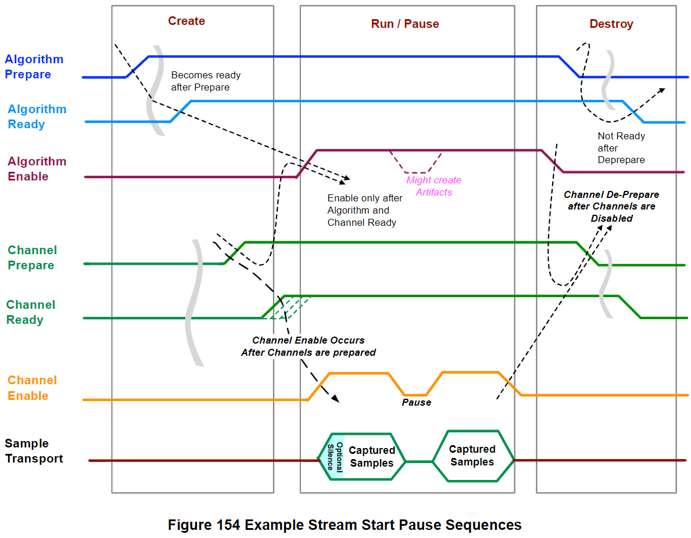

Using SDCA with SoundWire
=======

描述 SoundWire 如何用 SDCA 來傳輸 audio payload data 和 control information。

Addressing of SDCA Resources
-------

#### Hirarchical Addressing of SDCA Controls ####

Controls 可以用 26-bit Hirarchical Address 來辨別，由以下元素組成 (Figure 151)：

- `Function Number` (3 bits)
    - 每個裝置最多可以有 **1 ~ 8** 個 SDCA Functions (例如麥克風、放大器等)
- `Entity ID` (7 bits)
    - 每個 Function 最多可以有 **1 ~ 127** 個 Entities
    - 其中 `Entity ID #0` 保留給 Function-Level Controls 使用
- `Control Selector` (6 bits)
    - 用來識別 **1 ~ 48** 個標準化參數、或者 **1 ~ 16** 個自定義參數
- `Control Number` (6 bits)
    - 用來識別一個 Control 中 **1 ~ 64** 種的 instance
    - 用於識別 Entity 中對 per-Channel 的控制
    - `Control Number #0` 為 Main Control，可以一次影響 Cluster 中所有的 Channel
- `nMBQ_Atomic` (1 bit)
    - 0 : Access the primary byte
    - 1 : Access the queued byte
- `CN_Attribute` (1 bit)
    - 0 : Select Current Value Register (CVR)
    - 1 : Select Next Value Register (NVR)
- Reserved (2 bits)
    - Host / Manage 要將 Reserved Bits 設為 0，而 Peripheral Device 則可以直接忽略 Reserved Bits

#### Addressing for SDCA Memory Blocks ####

SDCA Device 可以有一個或多個 Memory Blocks for 一種或多種用途，例如：

- Firmware in XUs
- History Buffer in SMPUs
- UMP Message Buffer in several types of Entity

> 可以自定義要怎麼劃分記憶體 for 這些不同的用途。

Addressing SDCA Resources When Using a SoundWire Interface
-------

#### Accessing SDCA Controls with SoundWire ####

SoundWire 分配了 **64 MB** for SDCA Controls (`0x40000000` - `0x43FFFFFF`)。

設計 SDCA Hirarchical Address (映射到 SoundWire Address) 的目的是減少一直切換 Page 的次數，以增加 access Controls 的效率。

Device 用 Read/Write Command 時，26 bits Hirarchical Address 如下：

- bit[25:23] (3 bits) 是由第一個 Paging Register (`PCP_AddrPage1`) 提供
- bit[22:15] (8 bits) 是由第二個 Paging Register (`PCP_AddrPage2`) 提供

從上圖可以看到基本的 SDCA Controls Access 都用 16A 而已，很少會去修改 bit 15~25 的 Paging Register 區域，以節省存取時間。

- `0x40000000` – `0x43FFFFFF`
    - SoundWire 分配給 SDCA for Audio Controls

#### Accessing SDCA Memory Blocks with SoundWire ####

SoundWire 分配了 **64 MB** for SDCA Memory (`0x44000000` - `0x47FFFFFF`)。

定址方式跟 SDCA Controls Access 一樣，可以直接看 Figure 153：

也可以直接用 BRA 來存取 Memory Blocks，BRA 還可以在不用 Paging Registers 的情況下提供 32-bit 的定址。

#### Allocating Address Space for Virtualized Memory in a Function Agent ####

某些 SDCA Memory（例如，用於 HID Messaging 的自定義 Buffer）實際上可能位於 Function Agent 中，例如 DSP。

分配給 SDCA Memory 的 64 MB SoundWire 位址空間中的前 1M 被保留用於此用途，而不是在 Device Function 本身實現的 Memory。這 1M 位址區塊對應於 Figure 153 中位址的 bit 25 ~ 20 (0b11111)：

- `0x44000000` – `0x47EFFFFF`
    - Memories implemented in Device Function (hardware)
- `0x47F00000` – `0x47FFFFFF`
    - Memories implemented in Function Agent (software/firmware)

#### Accessing Dual-Ranked Registers with SoundWire ####

當 Host 要用 Dual-Ranked Access Mode 來存取 SDCA Control(s)，它需要做以下事：

- 分配一個 commit group 給 Function
- Write the next Controls
- 寫一個 bitmask 1 到 PCP_Commit Register (不需要自己清零)
    - 寫入後會發生 commit operation，一次更新一群 Controls

#### Accessing Multi-Byte Quantities with SoundWire ####

用 SoundWire 學到的 MBQ 讀寫機制來讀寫 SDCA Controls。

#### Accessing Unimplemented SDCA Resources with SoundWire ####

Unimplementation SDCA Resources:

- A Function Number that is not implemented
- A Entity ID that is not implemented
- A Control Selector that is not implemented, or is Reserved
- A Current_Next bit that indicates a Next Value Register for a Control that is not dual-ranked
- A Control Number that is not implemented (e.g., the addressed Control Selector is specified as5673
having only Control Number 0, but the Control Number field contains a non-zero number)
- A Memory address that is not populated with memory

有發生以上 Unimplementation Resources 例子時通常是軟體發生錯誤了，此時 SDCA Device 硬體可能會用的回覆有：

- `Command_OK`
- `Command_Ignored`

Response for Writes 在各種情況的對應動作 :

Response for Reads 在各種情況的對應動作 : 

#### Immediate Access to SDCA Controls with SoundWire v1.2 ####

看一下每個 SDCA Control Access Mode 對應到 SoundWire 那邊有哪些限制就好。

> Host Agent 不會對 DC Access Mode 執行 bus access。

Host Software Sequences for Stream Control
-------

#### Class Software Load Sequence ####

在 SDCA Audio Function Ready to Use 之前，Host 要做下面步驟：

1. Class Software 讀取 Entity0 的 `Function_Status` Control
2. 如果 **`Function_Status` 的 [bit 6] 是 1（`Function_Has_Been_Reset`）**，則：
    - A. 跳到 Step#4（跳過 Step#3 的 reset）
3. 如果 **Step#2 看到 `Function_Status` 的 [bit 6] 是 0**，則：
    - A. 寫 1 到 `Reset_Function_Now` bit
    - B. 然後 Polling `Reset_Function_Now` bit，直到看到它被清為 0
4. 檢查 `Function_Status` Control 的值 (可以使用剛剛 Step#1 讀到的值或重新讀一次)
5. 如果 **`Function_Status` Control 的 [bit 5] 是 1（`Function_Needs_Initialization`）**，則：
    - A. 把 Function Initialization Table 所描述的 bytes 寫入
    - B. Write 1 clear Function_Status [bit 5]（`Function_Needs_Initialization`）
6. 如果 `Function_Status` Control 的 [bit 6] 是 1（`Function_Has_Been_Reset`），而且 Control 是由 Class Software 管理的話，則：
    - A. 寫入 Default Values，或恢復成先前保存的值
---
**Default Value Priority**
- User or OS
- Class Software
- Platform-specific Default Value specified in a DisCo
    - mipi-sdca-control-default-value
    - mipi-sdca-control-cn-<n>-default-value
- Specification-define hardware reset value
- Implementation-defined hardware reset value
- A Known existing value (初始化前設定的Value)
- An unknown/unpredictable value
---

7. Write 1 Clear Function_Status [bit 6]（`Function_Has_Been_Reset`）
8. 清除 Function_Status 中的其它位元：對所有 High bits 寫 1，或直接寫入 0xFF 也可以
9. 打開所有必要的 Interrupt（例如 `FDL_CurrentOwner`, `AE_Number`, `OpaqueSetReq_Index`, `Function_Status`）
10. 檢查 FDL_CurrentOwner, AE_Number 和 OpaqueSetReq_Index 的 Control 是否有任何變化或未處理的 interrupts，然後：
    - A. 完成（或委派給 Extension Software）所有未處理的 requests
11. 等待直到沒有新的 File Download、Algorithm Extension 或 Opaque Set requests
12. 如果 Function 有任何 Mic 輸入，那就要在每個 Mic 的 IT 中對 Control `Mic_Bias` 進行控制
13. Class Software 現在可以開始使用 SDCA Audio Function 了~

> 在執行上述步驟時，不要去更改 PDE Power State。

#### Stream Create Sequence ####

Stream Create 有五個 Stages，Class Software 必須按照 Stage 的順序去完成。

**STAGE 1**

Class Software 在 STAGE 1 要執行以下七個步驟，**但是執行順序沒限制**：

1. 去設定和以下相關的每個 Clock Sources (CSs) 的 `CS:SampleRateIndex` Control
    - A. Every Streaming IT that will consume an input Stream
    - B. Every Streaming OT that will produce an output Stream
    - C. Every Transducer IT that will consume an input Stream
2. 設定 Streaming Terminal(s) 的 IT/OT:`Usage` Control 

Note: 要注意更改 `Usage` Controls 可能會讓 SMPU History Buffer 丟棄內容並重啟

3. 設定 Terminal(s) 的 IT:`ClusterIndex` Controls

Note: 要注意更改 `ClusterIndex` Controls 可能會讓 SMPU History Buffer 丟棄內容並重啟

4. 設定 Streaming Terminal(s) 的 IT/OT:`DataPortSelector` Control
5. 根據 DisCo Properties `mipi-sdw-lane-list` 中報告的可與所選 DP 一起使用的 SoundWire Lane(s) 去設定 DP 的 `DPn_LaneCtrl`
6. 根據 current Posture 去設定 PPU:`HorizontalBalance`, PPU:`VerticalBalance`, and PPU:`PostureNumber`
    - A. 如果 PPU 引發 `OpaqueSet_Req` Interrupt，或者如果 DisCo data 指示需要 Opaque Set，則：
        - 去設定 UDMPU:OpaqueSet
    - B. 計算 FU:`Volume` Controls 的後續變化，可能出現的變化有：
        - Left Volume (for Channels with Relationship:Left)
        - Right Volume (for Channels with Relationship:Right)
        - (Left+Right)/2 (for Channels with any other Relationship, such as Center)
7. 根據所需去設定 UDMPU、CRU 和 MFPU 中的 `ClusterIndex`

> 接下來 STAGE 2~5 都需要按照步驟順序做

**STAGE 2**

8. [Optional] 告知 SoundWire Controller Software 不可以 ClockStop
9. 將 PS0/1（或 PS2）寫入對應的 PDE:`Requested_PS` Control
10. 若有需要準備的 Algorithm n，則要將在 MFPU:`Algorithm_Prepare` Control 的 [bit n] 寫 1：
    - A. Host Agent 要準備所有具有指示 MFPU-Required CBN 的演算法（Table 103）
    - B. Host Agent 要準備所有標示為 MFPU-Optional-* 的演算法（Table 103）
11. 透過 `AE_UMP` 下載適當的 Algorithm Extension data 來回應 MFPU:`AE_Number` Control 中的任何 Requests

**STAGE 3**

12. Class Software 要等待（with timeout）所有 PDE:`Actual_PS` Control 變成 PS0/1
    - A. 如果發生 timeout，但某些 PDE:`Actual_PS` 還沒變 PS0/1，則 Stream Create 就失敗了
13. Class Software 要等待（with timeout）直到 MFPU:`Algorithm_Ready` Control 的 [bit n] 對所有具有表示 MFPU-Required CBN 的演算法為 1（Table 103）
    - A. 如果發生 timeout，但 MFPU:`Algorithm_Ready` Control 對應於 MFPU-Required 演算法的 [bit n] 不是 1，則 Stream Create 就失敗了
    - B. 如果在 timeout 後，MFPU:`Algorithm_Ready` Control 中所有的 [bit 0] 都可以對應到 MFPU-Optional 算法，則 Stream Create 不會失敗
14. 如果 Function 是具有 Trigger Path 的 SmartMic，則：
    - A. 對於每個需要的 trigger，將 1 寫入 SMPU:`Trigger_Enable` Control
    - B. 選擇所需的 Clock Source (如 Section 5.3.6)
    - C. 將 PDE:`Requested_PS` Control 從 PS0/1 更改為 PS2，然後
    - D. 等待 PDE:`Actual_PS` Control 變成 PS2
15. [Optional] 通知 SoundWire Controller Software 可以 ClockStop

**STAGE 4**

16. 根據 DisCo Properties mipi-sdw-lane-list 中報告的可與所選 DP 一起使用的 SoundWire Lane(s) 去設定 DP 的 DPn_LaneCtrl
17. 設定 SoundWire Transport（例如 DP Channel Prepare、設定 PortFlowMode）

**STAGE 5**

18. 驗證其它所有相關的 Streams（例如，D2D input/output, Sense output）也已成功完成 Stream Create Sequence Stage 1 ~ 4

#### Stream Start/Run Sequence ####

Stream Start/Run 有三個 Stages，Class Software 要按照順序完成這些步驟：

**STAGE 1**

1. 如果 PDE 的 Actual_PS 處於 PS2，則：
    - A. [Optional] 通知 SoundWire Controller Software 不可以 ClockStop
    - B. 把 `Requested_PS` Control 設成 PS0/1
2. 讀取 MFPU 的 `Algorithm_Ready` Control，並且對於 `Algorithm_Ready`[bit n]=1 的位元寫入 MFPU:`Algorithm_Enable`[bit n]=1
3. 在所有有 `Clock_Valid` 的 Clock Source 等待 CS:`Clock_Valid`=1
4. [只適用於具有 Trigger Paths 的 SmartMic Function] 寫 CX:Clock_Select=1 來選擇 bus clock source

**STAGE 2**

5. Enable SoundWire Transport（例如 `DP_Channel_Enable`[ch]=1）

**STAGE 3**

6. 檢查所有其他相關的 Streams（例如，D2D input/output、Sense output）也已成功完成 Stream Start/Run Stage 1 ~ 2

#### Stream Pause Sequence ####

Stream Pause 有三個 Stages，Class Software 要按照順序完成這些步驟：

**STAGE 1**

1. Pause SoundWire Transport (例如設定 `DP_Channel_Enable`[ch]=0)

**STAGE 2**

> Enable trigger 的 SmartMic Function 的 Stage 2 步驟其他 Function 不同。

For Smart Mic Functions with Triggers Enabled:

2. 在任何用於 offline triggering 且有 `Clock_Valid` Control 的 Clock Source 中等待 `Clock_Valid` Control 轉為 1
3. 設定 CX:`Clock_Select`=2 來選擇 offline clock source
4. 在控制用於 offline triggering 的 Transducers 的 PDE 中將 PS2 寫入 Requested_PS Control
5. [Optional] 通知 SoundWire Controller Software 可以 ClockStop

For All Other Functions:

6. [Optional] 如果沒有 active Streams，則將 PS3 寫入所有 PDE 中的 `Requested_PS`
7. [Optional] 如果沒有 active Streams，則通知 SoundWire Controller Software 可以 ClockStop

**STAGE 3**

8. 驗證所有其他相關 Streams（例如，D2D input/output、Sense output）也已成功完成 Stream Pause Stage 1 ~ 2

#### Stream Resume Sequence ####

Stream Resume 有三個 Stages，Class Software 要按照順序完成這些步驟：

**STAGE 1**

> Enable trigger 的 SmartMic Function 的 Stage 1 步驟其他 Function 不同。

For Smart Mic Functions with Triggers Enabled:

1. [Optional] 通知 SoundWire Controller Software 不可以 ClockStop
2. 在控制用於 offline triggering 的 Transducer 的 PDE 中將 PS0/1 寫到 `Requested_PS`
3. 在所有 Clock Source 中等待 `Clock_Valid` 轉為 1
4. 設定 CX:`Clock_Select`=1 來選擇 bus clock source

For All Other Functions:

5. [Optional] 通知 SoundWire Controller Software 不可以 ClockStop
6. 在所有 PDE 中，將 PS0/1 寫入 `Requested_PS`

**STAGE 2**

7. 驗證所有其他相關 Streams（例如，D2D input/output、Sense output）也已成功完成 Stream Resume Stage 1

**STAGE 3**

8. 設定 `DP_Channel_Enable`[ch]=1 或切換回 normal Stream 來恢復 SoundWire Transport

#### Stream Close/Destroy Sequence ####

Stream Close/Destroy 有三個 Stages，Class Software 要按照順序完成這些步驟：

**STAGE 1**

1. 結束 SoundWire Transport (例如 DP Channel De-Prepare)

**STAGE 2**

2. 將 0 寫入 MFPU 的 `Algorithm_Enable` 的所有位元
3. 將 0 寫入 MFPU 的 `Algorithm_Prepare` 的所有位元
4. 如果沒有其他 active Streams，則將 PS3 寫入所有 PDE 的 `Requested_PS` 
5. 通知 SoundWire Controller Software 可以 ClockStop

**STAGE 3**

6. 驗證所有其他相關 Streams（例如，D2D input/output、Sense output）也已成功完成 Stream Close/Destroy Stage 1 ~ 2

#### Interaction Between Stream Flow and MFPU Algorithms ####

Figure 154 說明了 Stream Flow（Preparing, Enabling, Disabling DP Channels）與 MFPU 演算法 Flow（Preparing, Enabling, Disabling Algorithm）之間的互動：

一些 SoundWire DP 在其 Channels Prepare 好後開始觀察 Stream Start Pause (SSP)，即使 DP 沒啟用也會。因此，當 Host 透過 disable DP Channels 來 Pause Stream 而這些 Channels 仍保持準備狀態時，它應該繼續使用該 Stream 的 Sample Interval 作為其最小公倍數計算的一部分，以選擇在何處插入 SSP 指示。

Initialization of Device Functions Using Initialization Writes
-------

在 Device Function 回報要做初始化（透過設定 Entity0 的 `Function_Status` Control 中的 `Function_Needs_Initialization` bit）之後，Host Agent 要發出 write operation sequence。

> write operation sequence 定義在 Function Initialization Table。

完成 intialization write sequence 後，Host Agent 要清除 `Function_Needs_Initialization` bit。

Device Function 可能會隨時向 Host 回報它需要做 Initialization Write，而不只在 SDCA_Reset 後會回報。

> Device Function 會設定 Entity0 的 `Function_Status` Control 中的 `Function_Needs_Initialization` bit 來告知 Host 現在需要做初始化。