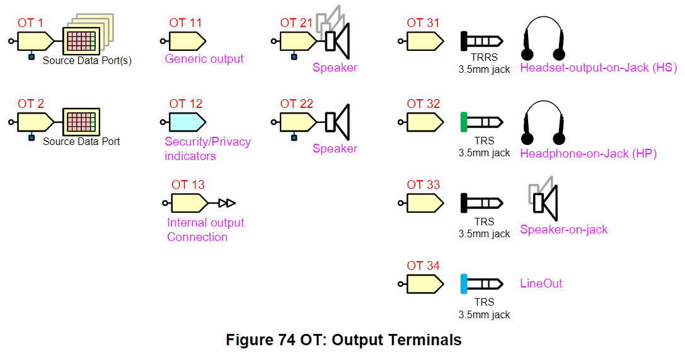
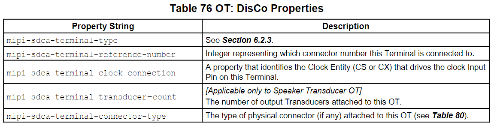
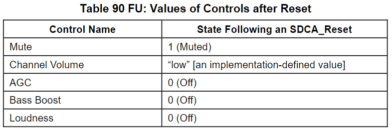
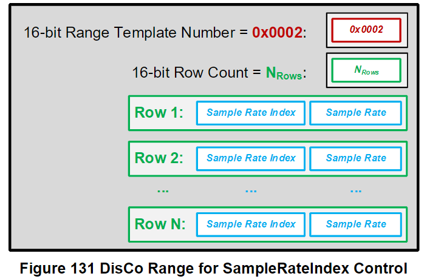
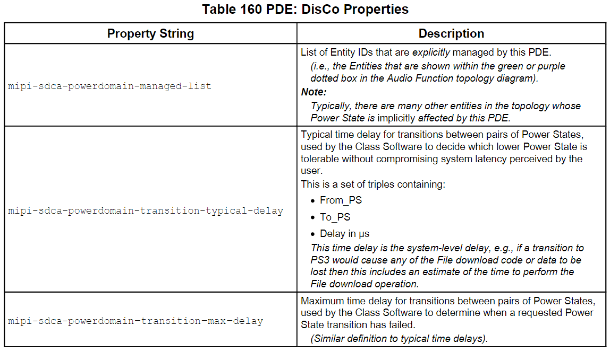
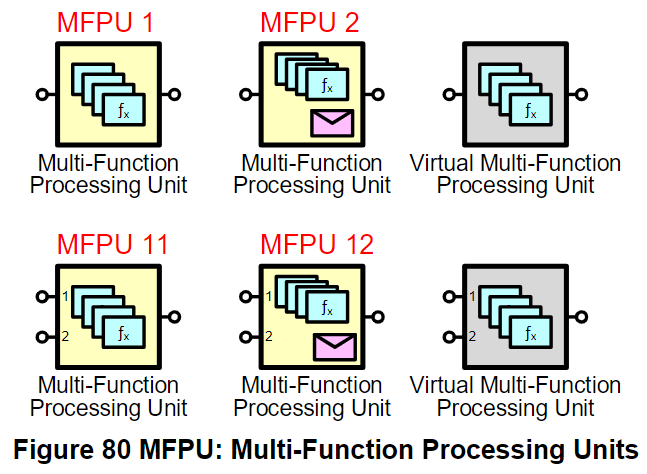

Entities
=======

Input Terminal (IT)
-------

Figure 73 是 IT 的拓樸符號：

> 進入 IT 的 signal 可以是 analog 也可以是 digital

- **Streaming ITs** : 供 Sink DP 餵訊號進來
- **Transducer ITs** : 供非 Sink DP 餵訊號進來
- **Security-Privacy ITs** : 供餵 security- and/or privacy-related 訊號進來

#### IT: Controls ####

Table 64 是 Streaming IT 的 Controls

Table 65 是 Transducer IT 的 Controls

> Device 不可以同時使用 MIC_Bias 0x03.NCN[0] 和 0x03.NCN[1-n]

Table 66 是 NDAI IT 的 Controls

Table 67 是 Privacy IT 的 Controls

#### ClusterIndex Control in an IT ####

`ClusterIndex` Control 用於選擇要讓哪個 Cluster 輸入進來。

- **For a Streaming IT**: Class Software 用 `ClusterIndex` 來選擇有多少個 Channels，以及要在 Sink DP 中 enable 哪些 Channels
- **For a Transducer IT** : Class Software 用 `ClusterIndex` 來選擇有多少個 Channels 要餵進來，並且可能會影響外部行為 (例如有多少麥克風接收偏壓)

#### Setting the MIC_Bias Control in an IT ####

下面任一項都可能會去設定 IT:`MIC_Bias` Control :

- 在 reset 後由 Class Software 寫入預設值
- An Extension Software Agent
- A Group Entity (GE)

#### IT: Controls with Reset Values ####

SDCA_Reset 後的值如下表：

> Table 68 的 reset value 都需要自定義。

#### IT: DisCo Properties ####

下表是 IT 專用的 DisCo Properties 列表：

#### IT: Interrupt Sources ####

IT 沒有任何 Standardized Interrupt Sources，其行為由 Standard Class Software 處理。

> 可以自定義 IT 的中斷來源。

#### ClusterIndex (in IT/CRU/MFPU/UDMPU) ####

- ClusterIndex Control 用來控制或報告目前由 Entity 的 output pin 生成的 cluster
- 在 UDMPU 中，ClusterIndex 可以影響對信號的處裡 (例如對放大器中的 Transducer 進行均衡)
- 當 ClusterIndex 和 Bypass Control 同時存在時（例如，在 UDMPU 中），Bypass 可以覆蓋 ClusterIndex Control 的當前設定
- 當軟體將 Bypass Control 改為 1（bypassed）時，輸出的 Cluster 要跟 Input Pin #1 上的 Cluster 相同，但 ClusterIndex Control 本身不應從其當前值變化
- 當 Bypass 為 1 時，該 Unit 不應對輸送到 Output Pin 的信號進行處理
- ClusterIndex Control 值 0 表示 Entity 的 Output Pin 上的 Cluster 遵循輸入到其 Input Pin 1 的任何 Cluster 定義
- Access Mode 為 RW 的 ClusterIndex Controls 可能在 SDCA_Reset 之後具有自定義的值
- 在使用包含具有 Access Mode 為 RW 的 ClusterIndex Control 的 Entity 的 signal path 之前，Host Software 應將 ClusterIndex 設定為已知的值
- 每個 ClusterIndex 都可以對應到一個 ClusterID (Figure 116) 

- 接下來可以在 DisCo Cluster Library 中用 ClusterID 查找對應的 Cluster (Figure 155) 

Output Terminal (OT)
-------

Figure 74 是 OT 的拓樸符號：

> 輸出 OT 的 signal 可以是 analog 也可以是 digital

- **Streaming OTs** : 輸出到 Sink Data Port
- **Transducer OTs** : 輸出到 External Transducer
- **Security-Privacy OTs** : 輸出 security- and/or privacy-related output

#### OT: Controls ####

Table 71 為 Streaming OT Controls List

Table 72 為 Transducer OT Controls List

Table 73 為 NDAI OT Controls List

Table 74 為 Privacy OT Controls List

#### OT: Controls with Reset Values ####

OT Controls 在 SDCA_Reset 後的值如下：

#### OT: DisCo Properties ####

下表是 OT 專用的 DisCo Properties

#### OT: Interrupt Sources ####

OT 沒有任何 Standardized Interrupt Sources，其行為由 Standard Class Software 處理。

> OT 可以自定義中斷來源

#### DataPort_Selector Control (in IT & OT) ####

- 用來控制哪個或哪幾個 DP(s) 來跟 Terminal 傳送/接收 Streams
- 共 16 bits，由 4 × 4 nibble-indexes 組成 (Figure 117)
    - 也就是說一個 IT/OT 可以連接最多 4 個 DP 

- Figure 117 DataPort_Selector Control 填完後會去對應 Figure 113 Data Port Selector Map，如此一來就可以知道 IT/OT 被 connect 到哪個 DP 

#### Usage Control (in IT & OT) ####

- `Usage` Control 裡面有個 1-byte 整數 (`Usage Number`)
- 用 `Usage Number` 可以對應到 DisCo Information 的 Usage Map 裡面 Row (Figure 118/119)
- 為 Optional Control，但發生以下兩項時就要強制使用:
    - 對於 Stream IT/OT，當 Function 不支援所有 SampleRate/SampleWidth 組合時，就要用 Usage Control 來報告支援哪些組合 
    - 對於 Stream IT/OT，當 Function 不支援 SampleRate 一半（即奈奎斯特限制）的頻寬時，IT/OT 就要用 Usage Control 報告頻寬。例如：SmartAmp render path 使用 96kSamples/sec，但卻不支援 Ultrasound 

Usage Control 提供額外資訊來幫助 internal signal format 和 dynamic range 與 Host Agent 期望的 external stream format（DP or Transducer）相容。一些 Usage Control 用於將有關可能設定的資訊從 Device Function 傳送到 Host Agent，一些則用於將選擇從 Host Agent 傳送到 Device Function，還有一些是兩者都用。

- Usage Map 裡面還會有 Usage CBN，可以對照 Table 185 來使用

#### MIC_Bias Control (in IT) ####

- 使用 Analog Microphone 時會用到 MIC_Bias Control
- 可以使用 Control Number 0（適用於所有 Channels）或 Control Number 1 ~ N（單獨控制某一個 Channel）
- MIC_Bias Control 為一個 1-byte Spec-Encoded Value，對應的是事先定義好的偏壓 (Table 186)

#### Matching_GUID (in IT/OT/Function-Level) ####

- 共 128 bits 且 Read-Only (放在 16 個 1-byte 的 Control Number 中) 
- 用於將 Function 與系統內的其他東西進行配對 
    - 例如讓 SDCA Function 跟外部顯示器的 driver 進行配對，讓顯示器的 audio 可以透過 SDCA Function 來播放

Feature Unit (FU)
-------

FU 使用的符號可以看 Figure 79：

- User FUs
- Application FUs
- Class FUs
- Platform FUs
    - Platform FUs 跟其它種類 FUs 有以下相異處
        - 不是 dual-ranked
        - 通常使用 Gain Control (不是 Volumn Control)

FU 可以對輸入的每個 Channel 做一些像是 mute, volumn control 等操控，而且可以一次只操控一個 Channel。

#### FU: Controls ####

User, Application, Class, Platform FUs 各自擁有的 Controls 都不同。

Table 86 為 Class FU Controls 列表：

Table 87 為 User FU Controls 列表：

Table 88 為 Application FU Controls 列表：

Table 89 為 Platform FU Controls 列表：

#### FU: Controls with Reset Values ####

Table 90 是在發生 SDCA_Reset 後指定的 FU Controls 值：

有些 Controls 會在 DisCo Properties 的 `mipi-sdca-control-default-value` or `mipi-sdca-control-cn-<n>-default-value` 裡面註記 SDCA_Reset 後的值要怎麼設定。

#### FU: DisCo Properties ####

沒有專門給 Feature Unit 的 DisCo Properties。

#### FU: Interrupt Sources ####

Feature Unit 並沒有任何標準化的 Interrupt Sources，這些 Interrupt Sources 的行為能被 Standard Class Software 理解。然而，在一個 Feature Unit 內部可能存在自定義的 Interrupt Sources，這些 Interrupt Sources 將由像是 Extension Driver 之類的東西來處理，而不是由 Standard Class Software 來處理。換句話說，這些特定的 Interrupt Sources 並不遵循通用的規範，而是由特定的驅動程式來管理和處理。

#### FU: Notes on Behavior of Device Class Software ####

典型的 Device Class Software 的行為是：

- 忽略 Platform FUs 的 Controls，這些 Controls 是由平 platform-initialization software 設定的
- 使用個別的 Channel Volumn Control 來控制音量

#### Platform FUs ####

- Platform FUs 是一種特殊的 FUs，通常只被 platform-initialization software 所存取
- Platform FUs 沒有 dual-ranked control，因為 platform-initialization software 不需要對運行中的系統進行同步更新
- Platform FUs 的 Control Access Mode 是 RW，因為 Software Agent 在正常操作時可能也會 Read Controls
- Platform FUs 有 Gain Control 而非 Volumn Control
- Platform FUs 的 Control 通常用於 platform-level 的 Gain 修改

Platform FUs 應該要實現以下任一項：

- A Main Gain (i.e., 0x0B.0) Control
- A Channel Gain (i.e., 0x0B.1–n) Control
- No Gain Control

#### Mute Control ####

- 1-bit Control
    - `1` : signal is muted
    - `0` : signal is unmuted
- 可以用 Control Number 0 一次控制所有 Channels；也可以用 Control Number 1 ~ N 來獨立控制 Channel 1 ~ N

#### Volume Control ####

- Volume Control 都用在 non-Platform FUs (User/Class/Application)
- 使用 Q7.8 的格式表示，共 16 bits，範圍是 −128.0 dB ~ +127.996 dB
    - 1 bit 表示正負號
    - 7 bits 表示整數部分
    - 8 bits 表示小數部分
- 可以用 Control Number 0 一次控制所有 Channels；也可以用 Control Number 1 ~ N 來獨立控制 Channel 1 ~ N

#### Gain Control ####

- Gain Control 都用在 Platform FU
- 使用 Q7.8 的格式表示，共 16 bits，範圍是 −128.0 dB ~ +127.996 dB
    - 1 bit 表示正負號
    - 7 bits 表示整數部分
    - 8 bits 表示小數部分
- 可以用 Control Number 0 一次控制所有 Channels；也可以用 Control Number 1 ~ N 來獨立控制 Channel 1 ~ N

#### AGC Control ####

- 1-bit Control
    - `1` : AGC is on
    - `0` : AGC is off
- 可以用 Control Number 0 一次控制所有 Channels；也可以用 Control Number 1 ~ N 來獨立控制 Channel 1 ~ N

#### Bass Boost Control ####

- 1-bit Control
    - `1` : Bass Boost is on
    - `0` : Bass Boost is off
- 可以用 Control Number 0 一次控制所有 Channels；也可以用 Control Number 1 ~ N 來獨立控制 Channel 1 ~ N

#### Loudness Control ####

- 1-bit Control
    - `1` : Loudness is on
    - `0` : Loudness is off
- 可以用 Control Number 0 一次控制所有 Channels；也可以用 Control Number 1 ~ N 來獨立控制 Channel 1 ~ N

Mixer Unit (MU)
-------

Mixer Unit 的符號可以參考 Figure 81：

Mixer Unit 可以把多個 Input Channels 混合並輸出在一個 Output Channel 上。

#### Platform MUs in SDCA-Defined Functions ####

- 用於產生 unity-gain 的 Mixer Control 的實際值是 platform-specific 的，例如可能是 0 dB, −3 dB, −6 dB 等
- Mixer Control 的值也可能是 −∞ dB，也就是 muted connection
- 在某些情況下，這些 Gain 值由 Host Agent 複製 DisCo Properties `mipi-sdca-control-cn-<n>-default-value` 的值寫入 Mixer Control

#### MU: Controls ####

Table 106 為 MU Controls 列表：

#### MU: Mapping of Control Number to Cross-Point Mixing Matrix ####

Figure 82 解釋 MU Control 是怎麼做 mix 的：

- Output Pin 有 Q 個 Channel
    - 這些 Channels 都是由多個 Input Pin mix 出來的結果
- MU 有 P 個 Input Pin
    - 每個 Input Pin 又都自己有好幾個 Channel

Figure 64 為 Control Numbers in the UAJ sidetone mixer 的範例：

> 用於 MU Control 的 Q7.8dB format 代表增益範圍 −128 dB 至 +127.996 dB

#### MU: DisCo Properties ####

沒有專門針對 Mixer Unit 的 DisCo Properties。

#### MU: Interrupt Sources ####

- Mixer Unit 並沒有任何標準化的 Interrupt Sources，這些 Interrupt Sources 的行為能被 Standard Class Software 理解
- 在一個 Mixer Unit 內部可能存在自定義的 Interrupt Sources，這些 Interrupt Sources 將由像是 Extension Driver 之類的東西來處理，而不是由 Standard Class Software 來處理

#### MU: Notes on Behavior of Device Class Software ####

MU 應該要實現以下任一項：

- 具有 DisCo Properties **`mipi-sdca-control-access-layer`=Class** 的 Fixed-Function Unity Gain Mixer（例如 UAJ Function 中的 side tone mixer）
- 具有 DisCo Properties **`mipi-sdca-control-access-layer`=Platform** 的 Mixer（例如，SmartAmp Function 輸出路徑中的配套 Input Stream Mixer）

#### Mixer Control (in MU) ####

- 可以在 mix crosspoint 設定 Gain 值
- 使用 Q7.8 的格式表示，共 16 bits，範圍是 −128.0 dB ~ +127.996 dB
    - 1 bit 表示正負號
    - 7 bits 表示整數部分
    - 8 bits 表示小數部分
- Access Mode: DC, RO, RW, or Dual

Selector Unit (SU)
-------

Figure 87 為 SU 的符號表示：

- Class Selector
- Device Selector

Selector Unit 做的事就是從幾個 Input Pins 中選擇一個做為 Output Pin 輸出，中間不會做其它訊號處理。

#### SU: Controls ####

Table 129 是 Class SU 的 Controls 列表：

Table 130 是 Device SU 的 Controls 列表：

#### SU: Controls with Reset Values ####

在發生 SDCA_Reset 後，SU Controls 的預設值列表如 Table 131：

#### SU: Interrupt Sources ####

SU 沒有任何 Standardized Interrupt Sources，其行為由 Standard Class Software 來處裡。

#### Selector Control (in SU) ####

- 用來選擇要讓哪個 input pin signal 輸出
    - 設 0 代表 no signal 輸出到 output pin
- Access mode: RW (read-write)

Group Entity (GE)
-------

Figure 92 用 SDCA Audio Function Topology 來說明 GE：

- GE 是一種捷徑機制，允許 Host Software 透過單一個 Control `Selected_Mode`，對 Audio Function 進行一組相關的變更
- 當軟體寫入新的 Mode 到 `Selected_Mode` 時，Audio Function 中的多個 Control 和多個 Entity 就可以同時被更新

DisCo 屬性定義了哪些 Control 和 Entity 會被 GE 的 Selected_Mode Control 所改變。Audio Function Topology 中，任何可能受到 GE 影響的 Entity（例如 Selector Unit）都會用橘色背景和紅色虛線框來標示。

### GE: Behavior for Selecting Jacks in UAJ and RJ Functions ###

#### Device Behavior for Jack Insertion ####

當 Jack 插入時，

1. Device Function 要執行自定義的 detection algorithm 來判斷插進來的東西是啥
    - 在執行 detection algorithm 時，Device Function 可能會暫時把 `GE:Detected_Mode` Control 設為 2 (代表 `Detection_in_Progress`)
2. 接下來 Device Function 要再把 `GE:Detected_Mode` Control 設定成一個非 0 or 2 的值
    - 如果 `Selected_Mode` 目前的值無法安全的用於剛偵測到的 peripheral，則 Device Function 應該把 `Selected_Mode` 變更為與 peripheral 相容的值
    - 當 `Detected_Mode` 是已知的 peripheral 時（Mode 3 ~ N），則 Device Function 應該會把 `Selected_Mode` 變更為與 `Detected_Mode` 相同的值
3. 最後將 `IntStat_NN` 位元設為 1 (`NN` 是分配給 GE:Detected_Mode Control 的 interrupt number)
    - 如果對應的 `IntEnable_NN` 位元為 1，則會在 Ping Command 中報告此 interrupt 狀態

> Function Agent 也可能會協助 Device Function 做 detection algorithm

#### Class Software Behavior for Jack Insertion ####

當 Class Software 看到 `GE:Detected_Mode` Control 改變時 (可能是透過 polling 或 interrupt 看到的)，它必須執行以下至少一項：

1. 若新的 `GE:Detected_Mode` value 是一個已知的 peripheral (value 不是 1)，則會把這個 value 寫到 `GE:Selected_Mode` Control
    - 與 `GE:Detected_Mode` 的值相同
    - 該值不能是 1 或 2
2. 如果新的 `GE:Detected_Mode` 值為 Jack_Unknown（Mode 1），則會寫入 `GE:Selected_Mode` Control 以選取非 1 或非 2 的 Mode value
3. 如果新的 `GE:Detected_Mode` value 為 `Detection_in_Progress`，則不會更新 `GE:Selected_Mode` Control value

> 一個 GE:Detected_Mode 的變更可能會導致 Host 重新評估其他 GE:Selected_Mode 的決策

#### Class Software Prioritization Behavior with two Jacks ####

可以參考 Table 149, 150, 151, 152

Table 153 為 Detected_Mode 與 Selected_Mode 各種 Mode 下的解釋：

#### Device Behavior for Jack Removal ####

當拔除 Jacks 時，Device Function 需要做以下事：

1. 把 `GE:Detected_Mode` Control 設為 0 (Jack_Unplugged)
2. 把 `GE:Selected_Mode` Control 設為 0 (Safe_Mode)
3. 把 `IntStat_NN` bit 設為 1 (NN 就是分配給 GE:Detected_Mode Control 的 interrupt number)
    - 如果對應的 IntEnable_NN bit 也被設為 1 的話，那麼 Device 就會在 Ping Command 拉 Alert Status

#### Class Software Behavior for Jack Removal ####

當 Class Software 看到 `GE:Detected_Mode` value 改變時 (可能是透過 polling 或 interrupt 看到的)，如果新的 `GE:Detected_Mode` value 為 0，那麼 Class Software 需要把 `GE:Selected_Mode` 設為 0 (Safe_Mode)。

> Class Software 只要看到 `GE:Detected_Mode` 變了，就會去重新決策 `GE:Selected_Mode` 的值。

#### Multiple ITs for a Single Physical Jack ####

在 UJ 和 RJ 的 SDCA Audio Function Topology 中，有一個 GE 包含實體插孔以及與不同行為模式相關的多個 IT 和/或 OT，`GE:Selected_Mode` Control 會影響 Selector Unit 去選擇某一組 IT 或 OT。

#### Software Access to Controls that are Affected by a GE ####

會有 DisCo `mipi-sdca-control-access-layer` Property 來指示 Software 不要去 Update 哪種 Control (User, Application, Class, Platform, Extension, Implementation-Defined)。如果 Software 還是去 update 它，那麼 `GE:Selected_Mode` Control 就會被設為 2。

#### GE: Controls ####

Table 154 是 GE in the `UAJ` and `RJ` Functions 的 Control List。

#### GE: Controls with Reset Values ####

SDCA_Reset 後的設定值如下：

#### GE: DisCo Properties ####

GE 專屬的 DisCo Properties 如下：

#### GE: Interrupt Sources ####

GE 的 Standardized Interrupt sources 如下：

#### GE: Behavior of Device Class Software ####

Software 會使用 interrupt 來偵測 `Detected_Mode` Control 何時會因 Jack 的插入/拔出而發生變化。

當觸發 `Detected_Mode` interrupt 時會做以下事：

1. 若新的 `Detected_Mode` 值不是 `Jack_Unplugged` 或 `Jack_Unknown` 時，則 Software
    - A. 應該要給 Extension Driver 或 user 選擇 `Selected_Mode` 的機會
2. 若新的 `Detected_Mode` 為 `Jack_Unknown` 時，則
    - A. 首先要預設一個 platform-specific 的 default Mode（例如，因為僅實現了該 Audio Function 中的某些替代的 ITs 或 OTs 集合），然後：
    - B. 應該要給 Extension Driver 或 user 選擇 `Selected_Mode` 的機會，然後：
    - C. 要使用步驟 2A 和 2B 產生的 Mode 來更新 `Selected_Mode` control
3. 若新的 `Detected_Mode` 為 `Jack_Unplugged` 時，則 Software 不應該修改 `Selected_Mode`

#### Mode Values in GEs ####

- 每個 GE 的 DisCo Properties 會描述與每個 instances 特定的一組 Mode Numbers
- 對於每種 Mode，DisCo information 定義了一組值，當 Mode Numbers 寫入 `Selected_Mode` 時，這些值會出現在 Audio Function 內的一個或多個 Enitities 的一個或多個 Controls 中
- 將值寫入 `Selected_Mode` 實際上是一種捷徑，它取代了需執行一組寫入操作的 Host Software，並確保所有寫入操作同時發生
- 同一組 Mode Numbers 用於 `Detected_Mode` 和 `Selected_Mode` (unknown detected Peripheral 的特殊值除外)

Clock Source (CS)
-------

下圖是 CS 的拓樸圖：

#### CS: Behavior ####

CS 用在 Audio Function Topology 中提供訊號的 Sample Rate。

CS 有以下兩種用途：

- **CS for Streaming IT & OT** : 提供 Sample Rate 給 Data Port (Table 141)
- **CS for Transducer IT** : 提供可選擇的 clock source 給 Transducer (Table 142)
    - Transducer 有可能是麥克風等其它收音傳感器

#### Rules for Clock Source Attached to a Streaming IT and OT ####

1. 當 `mipi-sdca-cs-type` 為 2 (internal
synchronizable) 或 3 (internal for source-synchronous) 時 (參考 Table 143)，就要使用 CS:`Clock_Valid` Control
2. Host 要先等待 CS:`Clock_Valid` 變成 1 後才可以 enable Clock Source (`Clock_Valid` control) 連接到 Streaming Terminal (for DP Channel)

#### CS: DisCo Properties ####

下表是 CS 5專用的 DisCo Properties：

#### CS: Interrupt Sources ####

下表是 CS Entity 的 Standardized Interrupt Sources (也可以自定義自己的中斷)，當 `Clock_Valid` 從 `0` 變 `1` 時就觸發中斷。

#### CS: Examples of Commonly Used Sample Rates ####

下表是 SDCA Functions 常用的 Sample Rates：

#### SampleRateIndex Control (in CS)

- 是一個 byte index
    - Figure 131 是 SampleRateIndex Contol 的 mipi-sdca-control-range 的 DisCo Buffer 的結構
    - Figure 132 用 Figure 131 的結構來舉例

連接到 DP（例如 SmartMic 中的 CS17）的 OT/IT clock source 中的 SampleRateIndex Control 會通知 Audio Function 正在使用的 Sample Rate。

正在使用的 Sample Rate 有可能會低於 DP 的傳輸速率，例如，當：

- 使用 Flow-Controlled 以 48kHz 傳輸率來傳輸 44.1k Samples/sec 時
- 對更高速率的 Input Stream 使用正常（non-Flow-Controlled）傳輸，然後由 Input Terminal 進行二次取樣，例如，對於接收 full rate render stream 的 LFE 放大器

#### Clock_Valid (CS) ####

- 用於 Transducer CS 來指示 clock output 是有否有效
    - `0` : invalid (off or unstable or at the wrong frequency)
    - `1` : valid (stable and at the correct frequency)
- Access Mode : RO

Clock Selector (CX)
-------

下圖是 CX 的拓樸符號：

#### CX: Behavior ####

CX 會從輸入的兩個 input pins 中選擇其中一個當成 clock signal 輸出。

#### CX: Input & Output Pins ####

CX 會有兩個 clock input pins 和一個 clock output pin。

#### CX: Controls ####

下表列出了 CX 有哪些 Controls：

#### CX: Controls with Reset Values ####

在 SDCA_Reset 後，CX Controls 的值會如下表：

#### CX: Interrupt Sources ####

**CX 沒有任何 Standardized Interrupt Sources**，其行為由 Standard Class Software 來處理。

#### Clock_Select (CX) ####

- 從輸入的兩個 Clock Source 中選一個
    - `1` : The Output Pin is a copy of the clock on Input Pin 1
    - `2` : The Output Pin is a copy of the clock on Input Pin 2
- Access Mode : RW

Power Domain Entity (PDE)
-------

Figure 93 是 PDE 的拓樸符號：

PDE 是 Host Software 用來控制 Device power saving 的機制。

Software 會透過 `Requested_PS` Control 來更改 Device Power State，而再過一段自定義的 delay time 後，這項更改也會套用到 `Actual_PS`。

> Requested_PS / Actual_PS 可以參考 Section 7.14.4 / 7.12.3

PDE 的 DisCo Property `mipi-sdca-powerdomain-managed-list` 清單列出了所有的 PDE Entity ID。

#### Rules for PDEs ####

1. Device Function 可以將 PDE 的 `Actual_PS` Control 的效果丟給 Audio Function 內的其他 Entities，沿著從 Transducer ITs 的 signal path 向前（或者從 Transducer OTs 的 signal path 向後）
2. Device Function 可以將 PDE 的 `Actual_PS` Control 的效果丟給 Audio Function 內的其他 Entities，這些 Entities 與不直接位於來自 Transducer ITs 或 OTs 的 signal path 上的 ancillary Streams 相關
3. Host Software 應假設 PDE 已影響了給定的 signal path 內的所有 Entities，根據 Rule＃1
4. Entities 的有效電源狀態是
    - A. 在 DisCo Property `mipi-sdca-powerdomain-managed-list` 中列出該實體的 PDE 中 `Actual_PS` 的值，或是
    - B. 所有根據 Rule＃1 或 Rule＃2 傳播 `Actual_PS` 的 PDE 中 `Actual_PS` 控制的最高電源狀態

#### PDE: Controls ####

下表是 PDE 的 Controls：

#### PDE: Controls with Reset Values ####

SDCA_Reset 後 PDE Controls Value 如下表：

#### PDE: DisCo Properties ####

Table 160 是 PDE 專用的 DisCo Properties

#### Subset of Power States that is Supported in a PDE ####

1. Host Software 可以通過檢查每個 PDE 回報的 time delay list 來確定特定 PDE 支援的 Power State
2. 一般而言，在系統中的每個 component / Audio Function 都有一個用於 active state 的電源狀態（如 PS1/PS0）
3. 當系統同時支援 PS1 和 PS0 時，DisCo information 將包括 PS1 和 PS0 的轉換
4. 有一些 Audio Function 有 PS2（在設備上有部分音訊功能，但不透過 DP 進行 Streaming，例如 SmartMic trigger）
5. 某些 Device Function 的在 PS3 和 PS1/0 之間具有較高的延遲，但支援從 PS2 到 PS1/0 的低延遲 recovery（允許停止 bus clock）

- 從最耗電到最省電的 Power State 排序
    - PS0/PS1 (Active State)
    - PS2 (Local Function)
    - PS3 (Standby)

#### Selecting Unsupported Power States ####

Host Software 應僅要求對 DisCo information 中報告的 Power State 進行變更。如果 PDE:`Requested_PS` 使用了該 PDE 不支援的 Power State，則 `Effective Power State` 或 PDE:`Actual_PS` 不會改變。

#### PDE: Interrupt Sources ####

PDE 不具有任何 Standardized Interrupt Sources。

> PDE 可以自定義中斷來源

#### PDE: Notes on Behavior of Device Class Software ####

Host Software 的典型行為是將任何裝置或目前不活動的裝置的 Power State 降低到較低功耗，具體取決於為該裝置報告的最大延遲。將任何功能中的任意 PDE 的 `Requested_PS` 設定為 PS0 或 PS1 之前，Host 要先把正確的 current value 寫入 Device 的 `PCP_BusClock_Base` 和 `PCP_BusClock_Scale` Register。

當連接到該 bus 的任何 streaming Terminal 的 Effective Power State 為 PS0 或 PS1 時，則 Host 不可以停止 bus block。

#### Actual_PS Control (in PDE) ####

- Actual_PS Control 是個 8 bits Read-Only Control
    - 有效值是 0 ~ 4，對應 PS0/1/2/3/4 (Table 196)

**Rules for PDEs**

1. 當有個 PDE 被設定成 `Actual_PS`=PS4，則所有由該 PDE 控制的 Entities 都會變 inaccessible
2. 當 Device 的所有 non-XU-PDEs 被設定成 `Actual_PS`=PS4，則 Device 可以 detach from bus
3. Host Software 要假設在給定功能中的所有 non-XU-PDEs 均設定成 `Actual_PS`=PS4 後，該功能就會變成 inaccessible，直到 Device 收到 Peripheral Device-Level SDCA_Reset（例如，Bus Reset 或 Device-Level Power-on Event）
4. 未完待續...

#### Requested_PS Control (in PDE) ####

- `Requested_PS` 支援了 PS0/1/2/3/4 五種 Power State
- `Requested_PS` Control Values 是個 8 bits integer，範圍是 0 ~ 4 (Table 197)
- `Requested_PS` 的修改要透過 Host 來寫值
    - 修改 `Requested_PS` 後最終會傳播到 `Actual_PS`

Multi-Function Processing Unit (MFPU)
-------

- 一個 MFPU 可以對信號做一種或多種信號處理演算法，而這些演算法可以自定義
- `Algorithm_Enable` Control 可以 enable/disable 演算法
- `Algorithm_Ready` Control 會回報目前可用的演算法，其中一些算法可能需要通過 `Algorithm_Prepare` 的 request 才能用

#### MFPU Types: Null, Fixed-Function, Simple, Full ####

MFPU 又分下面四種型態

- Null MFPU
- Fixed-Function MFPU
- Simple MFPU
- Full MFPU

每個 MFPU Type 都有不同的 Controls。因此，Host Agent 可以透過偵測特定 Control 的存在與否來決定 MFPU Type，如 Table 91 所示：

#### Categories of MFPU Algorithm ####

根據 MFPU Type，MFPU 的演算法可分為 1、2 或 4 類中的一類。Table 92 描述了每個演算法類別如何使用 MFPU 的 `Algorithm_*` Control，以及 SDCA_Reset 後這些 Control 的值。RW Level 的 Control 可以由 Host Agent 寫入，但其 reset value 與演算法類別有關。

Human Interface Device Entity (HIDE)
-------

Figure 97 是 HIDE 的拓樸符號：

HIDE 裡面還包含了 UMP blocks 以用來收發 HID Reports。

- 一個 HIDE 必須至少要有以下其中一項：
    - A. 有 `HIDTx_UMP Producer` 用來發送 Device-to-Host HID Reports (例如按下 headset buttons)
    - B. 有 `HIDRx_UMP Consumer` 用來接收 Host-to-Device HID Reports (例如指示 LED 燈)

#### HIDE: Controls ####

Table 168 是 HIDE 的 Controls 列表：

#### HIDE: DisCo Properties ####

Table 169 是 HIDE 專用的 DisCo Properties：

#### HIDE: Interrupt Sources ####

Table 170 是 HIDE 的 Standardized Interrupt Sources：

> 也可以自定義 HIDE Interrupt Sources。

#### HIDE: Behavior of Device Class Software ####

Class Software 會對 HIDTx 和 HIDRx 中斷做出反應，從裝置接收 HID 訊息或向裝置發送 HID 訊息。每個來自或發送到 HIDE 的訊息都有一個 Report Type，定義了訊息的格式（HID Report），該格式使用 USB 規格書中定義的報告格式。

Function-Level (Entity0) Controls
-------

Entity0 是概念性的 entity，不會畫在 Topology 也不會在 DisCo data 中被描述，然後 Entity0 被用來做整個 Function 相關的控制。

Table 171 是 Entity0 Controls List：

#### Function-Level (Entity0) DisCo Properties ####

Table 172 列出了應用在 Entity0 的 DisCo Property：

#### Function-Level (Entity0): Interrupt Sources ####

Table 173 是 Entity0 的 Standardized Interrupt Sources :

> 也可以自定義自己的 Interrupt Sources。

Figure 98 Function_Status 的五個指定位元 (下圖的紅色處) :

Figure 134 組合起來產生 `Function_Status_Alert` Interrupt 的中斷狀態條件。這 5 個位元中的任 1 位元從 0 變成 1 都會去 set `IntStat` bit。為了清除該中斷，這 5 個位元都必須為 0。

#### Rules for Function-Level (Entity0) Interrupts ####

1. Function 應該要實施 `Function_Status` Interrupt
2. 倘若沒有實施 `Function_Status` Interrupt，但 UMP 把 `Function_Status[bit 4]` 從 0 改為 1 (`UMP_Sequence_Fault`)，此時 Function **要發起** Soft Reset (讓 Peripheral re-attach)
3. 倘若沒有實施 `Function_Status` Interrupt，但 Function 把 `Function_Status[bit 2/3/4/5/6]` 從 0 改為 1，則 Function **可以發起** Soft Reset (讓 Peripheral re-attach)

#### Function-Level (Entity0) Controls Used for Driver Selection ####

Host 使用了描述 Device, Function 和 Extension 的 Function-Level Controls 來產生 name string，以協助識別每個功能之正確的 Driver。Table 174 中列出了可用於每個 name string 的 Controls Set 的一些典型範例。

#### Function_Status (Function-Level) ####

- 用來指示 Function 的狀態
- Table 198 是 `Function_Status` Control

- Table 199 是 Reset 後的 Function_Status Value 表

**Host Software Handling of Function_Status**

Host Software 要以下順序來處理 Function_Status Control:

1. 若觸發了特定事件（例如：Power-up、Reset、Function_Status Interrupt、Deferred Control Read/Write Failure）就要去讀取 `Function_Status` Control
2. 根據 `Function_Status` 內的值去執行對應的動作
3. 如果對 `Function_Action` 寫入 0x01 (`Reset_Function_Now`)，這時候就要等待 Function_Action:`Reset_Function_Now` 被清除，然後再跳到 Step#6
4. 將 `Function_Status` 寫入 `Function_Status_Read_Value` & `0x7F`
5. 如果有設定了 `Ints_Disabled_Abnormally` bit，則要在 `SDCA_IntMask` 暫存器中寫入對應位元來 Enable Function_Status Control Interrupt
6. 再次讀取 `Function_Status` Control 以確保它是 `0` 或 `0x80`，如果是其他值的話，就要重新做 Step#2 ~ Step#5
7. 到這裡 Driver 就完成對 `Function_Status` Control 的處理了

Table 200，當 `Function_Status` 5 個位元中的其中一個位是 1，就會發生 `Function_Status` Interrupt：

#### Function_Action (Function_Level) ####

- 為 1-byte RW1S Control
- 用來調用 Function-Level 的運作 (例如 Reset)

#### Commit_Group_Mask (Function_Level) ####

- for Dual-Ranked 使用，透過將 1 寫入 Control 中的對應位元來選擇 Group (Table 202)
- 當支援 Dual-Ranked 時，就會支援 Commit_Group_Mask Control 和 SoundWire Commit Register

#### Function_SDCA_Version Control ####

- 為 1-byte，用 2-digit BCD 來表示

#### Function_Type Control ####

- 為 1-byte，用來識別是哪個 Function Topology，如 Table 1

