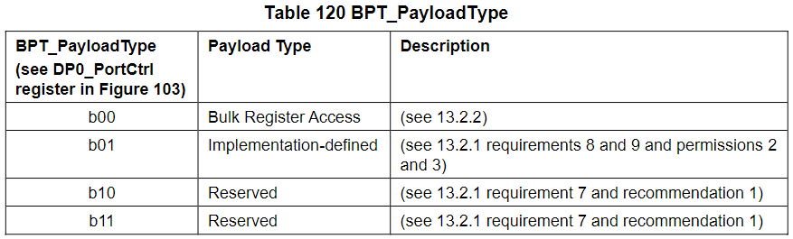
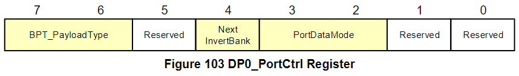
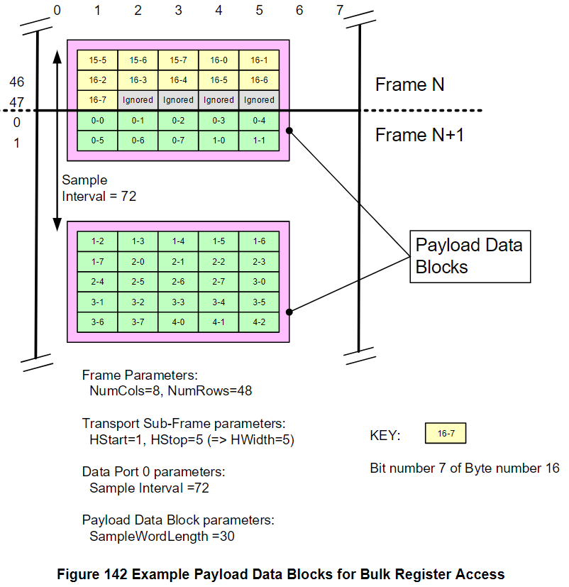
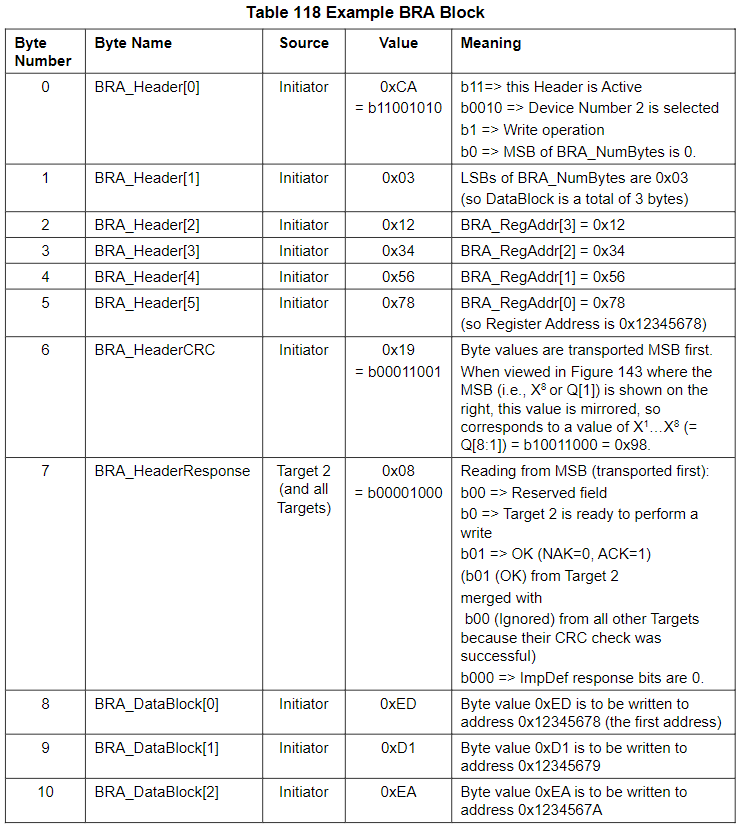
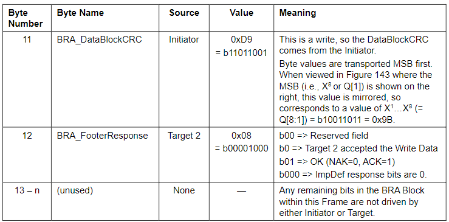
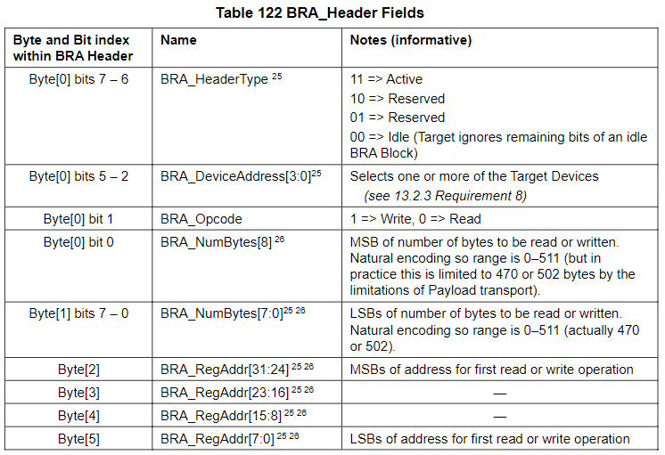
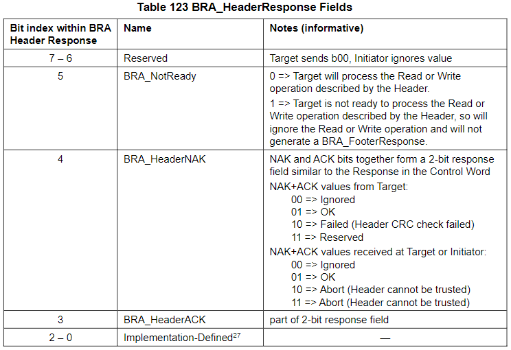
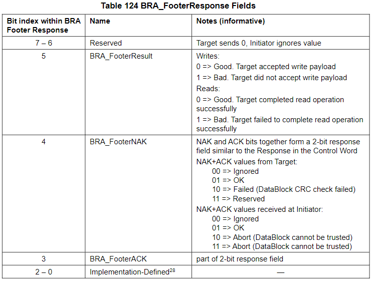
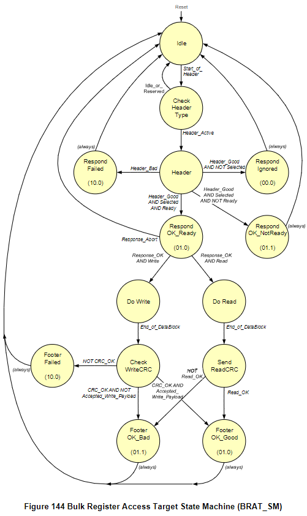

Bulk Payload Transport Protocol
=======

本章節會解釋 SoundWire Bulk Payload Transport Protocol (BPT) 和 Bulk Register Access (BRA)。

Overview
-------

BPT 使用了跟一般 Payload Streams 相同的傳輸機制，但 BPT 可以用來跟內部 client 進行通訊，尤其是 DP0 (但不能跟透過 DP1~14 連接的外部 audio client 進行通訊)。

BPT Payload Stream 的傳輸與接收端可以是任意的 Device，而且還可以同時多個 Devices 傳輸或接收。

BPT Payload Stream Abstractions
-------

BPT 會傳輸 Payload Channel Samples 序列到 client，client 可能會把 Payload Channel Samples 合併在一起行成一個更大的 bit stream。

BPT Payload Stream 可以看 `BPT_PayloadType` 欄位 (Table 120)，SoundWire 規格書中有定義了一個 Bulk Register Access 的 payload type。

`BPT_PayloadType` 欄位在 0x0002 `DP0_PortCtrl` Register 裡面，如 Figure 103：

> 也就是說只有 DP0 可以用 BPT

Data Port 0 Transport Capabilities
-------

DP0 使用與 DP1 ~ DP14 類似的 control fields，但由於進行了一些簡化，因此這些 DPs 的功能不適用於 BPT。 (這句話我有疑問)

- DP0 與其他 DP 的差異 
    - DP0 只有一個 channel，所以永遠只會用 `Block-per-Port` Mode
    - DP0 在多個 Payload Data Blocks 中只有一個 Block 會有一個 Payload Data Container，所以不需要 `BlockGroupControl`
    - DP0 不支援 Flow-Controlled Payload Transport，所以不需要 `PortFlowMode`
    - 每個 Payload Data Block 都包含了一個 Payload Data Container，而其中又包含了一個 `SampleWordLength` 數量的 Payload Channel Sample
    - DP0 的 Sample Interval 和 Block Offset 用法與其他 DPs 一樣，因此 (若有需要) DP0 可以把 BPT Payload Streams 和 normal Payload Streams 混合一起用

在做 BPT Payload Stream 時也可以直接把 `Sample Interval` 設為 Frame 的 Column 數，這樣會讓 DP0 變得更簡單。`SampleWordLength` 是傳輸 sub-frame 中的 Column 數，而 `HStart` 是這些 Column 中編號最小的 Column。

Bulk Register Access (BRA)
-------

BRA 是 BPT 數據傳輸的一種特殊格式，它用來讓一個 Device 把 Read/Write Operation 傳給一個或多個 Devices，而 Manager/Peripheral 都可以發起 BRA (雖然 Initiator 通常是 Manager)。

BRA 會用 BPT Payload Stream Abstraction 把一個 Frame 裡的 Payload Channel Samples 的位元合併到單一個 BRA Block，然後將其視為一組位元組。而該 BRA Block 描述了在 Target 中的一組遞增位元組位址處執行的一組 read or write operation。

BRA Payload Streams
-------

BRA Payload Stream 使用 Frame boundaries 來描繪 BRA Blocks 的開始 (就算這些 boundaries 發生在 Payload Data Block 的中間)。Frame 中最後一個 Payload Channel Sample 樣本中**超出 8 倍數的任何奇數位元**都將被忽略。

通常會選擇 `DP0` 的 Sample Interval，讓 Payload Channel Samples 不會跨越 Frame 邊界。但倘若有個 Payload Channel Sample 沒有跨越 Frame 邊界，那麼來自該 Payload Channel Sample 的位元將會被分割到兩個 BRA Blocks 之間。

Figure 142 說明了兩個 Payload Data Blocks 用於傳輸 BRA Payload Stream 來存取 DP0 的範例設定。可以看到一個 Payload Data Block 被分佈在 Frame N 和 Frame N+1 之間的邊界上。在第 16 byte 的最後 4 個在 Frame N 裡面的 Payload Channel Sample 位元被忽略。而 Payload Channel Sample 內和 Frame N+1 內的第一位元就是新的 BRA Block 的第一位元 (byte0, bit0)。

BRA Block Structure
-------

- 以下概述 BRA Block 的欄位用途
    - Initiator 發送的 BRA Header 會描述所需的操作，其中包括 device addresses, 要存取的第一個位元組的 address 和組數。Header 裡面還會有個 `HeaderType` 欄位會指示剩餘的 Header 和 BRA Block 是否已填滿
    - BRA Header CRC 可以讓 Targer 端去驗證 Header 有沒有在傳輸過程中出錯
    - (一個或多個) Target(s) 會回傳 BRA Header Response 來告訴 Intiator 自己是否接受該 Header (Target(s) 接受後才會去做相應的動作)
    - BRA DataBlock (可能是 Initiator 發出來 for Writes 或者 Target 發出來 for Reads) 裡面是一組要寫或讀回來的數據位元組
    - BRA DataBlock CRC 則是讓對方驗證 BRA DataBlock 的正確性
    - BRA FooterResponse 則是由一個或多個 Target 發出來說明 BRA DataBlock 的操作是否成功

Initiator 可能會被設計成 batch mode，也就是它會先把所有的 BRA_HeaderResponse, BRA_DataBlock (for Reads), BRA_FooterResponse 都收進來，然後繼續發出下一個 BRA_Header (如果有的話)，接下來才會去檢查剛剛收進來的東西有沒有問題。

此外，假設接收端檢查 BRA DataBlock CRC 發現 BRA_DataBlock 有錯誤時通常都為時已晚，因為可能已經有一部份數據被存放進暫存器了，這時可能會做的措施有以下：
- 嘗試透過重複失敗的相同 BRA Block 來重複同一組寫入操作
- 繼續執行其本來打算執行的後續寫入操作組，並稍後再修復該組的問題
- 在後續 BRA Block 中發送 Idle 的 HeaderType 值，直到使用讀取命令或 BRA 讀取操作來詢問目標，從而確定需要重新嘗試哪些操作

而如果 Initiator 看 Footer Response 指示 Abort，則 Initiator 要直接忽略 BRA 結果。

Example BRA Data Block
-------

Table 118 是 BRA Block 的範例，Header 描述要寫 3 bytes 到 Device Number 2 的 0x12345678 位址，而要寫的 3 bytes 值分別為 0xED 0xD1 0xEA。

BRA Block Fields
-------

#### BRA_Header ####

#### BRA_HeaderResponse ####

#### BRA_FooterResponse ####

BRA State Machine
-------

