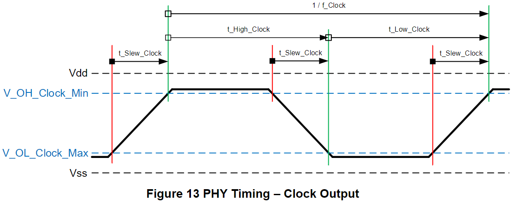
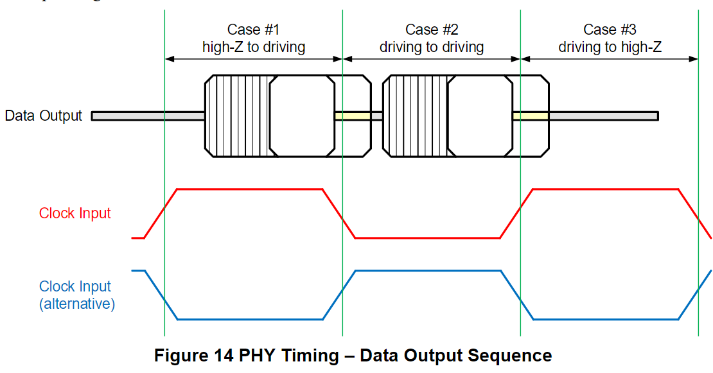
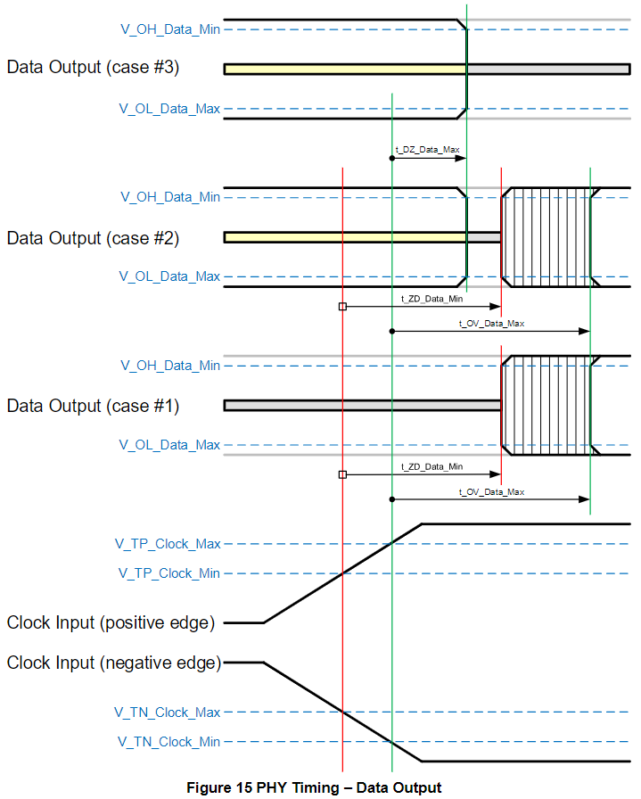
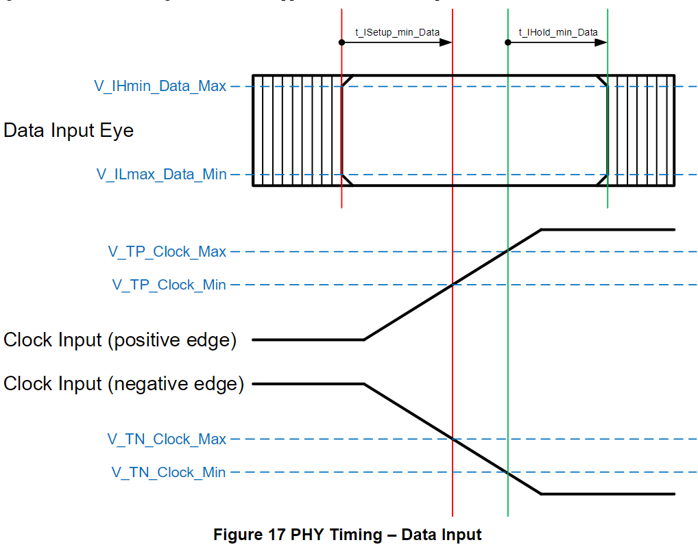
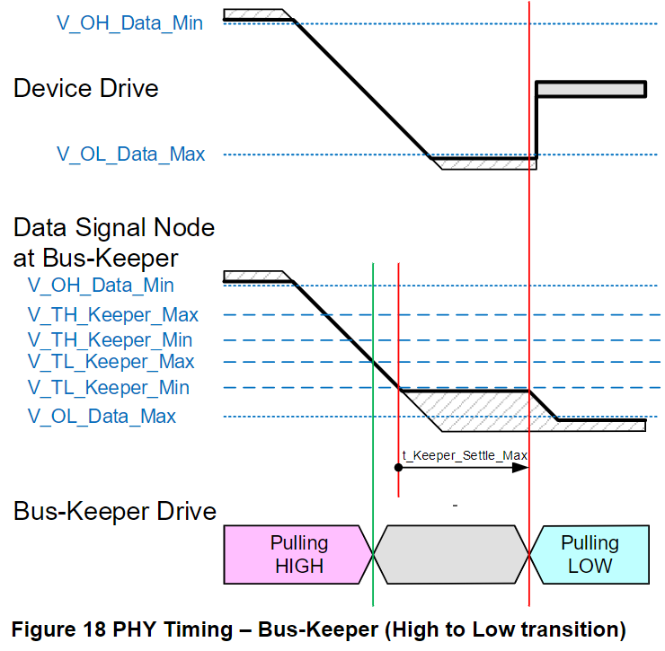
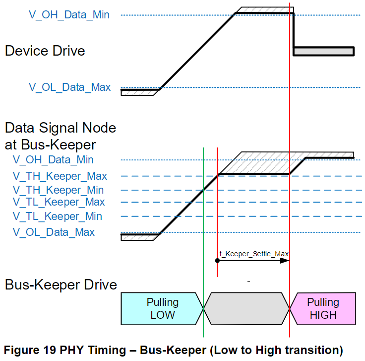

Physical Interface (PHY)
=======

PHY
-------

SoundWire 接口使用兩根信號線來做設備之間的連接：
- Clock : 從 Master 發送到全部 Slave 的 clock
- Data : 可以被所有設備驅動的 data 信號，並且可以配置沒有人驅動時的空載值

而訊號線電壓通常訂為 `1.2V` or `1.8V`。

Figure 8 為 SoundWire Master/Slave Interface，其內部的 digital interface 負責傳輸 payload, command 等；而 PHY 負責與其他 SoundWire 設備的物理連接。

Data Signaling and Bitslots
-------

#### Bitslots ####

SoundWire Frame 內的每一個 bit 就叫做 bitslot，frame 內的第一個 bitslot 就叫 `bitslot[0]`、第二個叫 `bitslot[1]`，後面以此類推。而一個 bitslot 內的值可能同時由多個 SoundWire 設備所提供，而提供了該 bitslot 值的設備，我們就將其稱為 the **owner** of the Bitslot。

#### DDR (Double Data Rate) ####

SoundWire 採用 DDR 進行數據傳輸，也就是可以在一個 clock cycle 內塞兩個 bits 的數據。一個 bit 在 clock rising edge 被驅動，並且在 clock falling edge 被取樣；下一個 bit 則在 clock falling edge 被驅動，並且在 clock rising edge 被取樣。換句話說，SoundWire 可以同時在 clock rising/falling edge 被驅動或取樣，因此數據傳輸的頻率是 clock 的兩倍。

#### Modified NRZI Data Encoding ####

Figure 11 是一般傳統 NRZI 的編碼方式，當數據為 1 時則改變電位 (High-to-Low or Low-to-High)，當數據為 0 時則 keep 電位，可參考下圖：

Figure 12 則是 SoundWire 採用的 Modified NRZI，跟傳統 NRZI 差異為，當數據為 0 時是透過一個高阻抗 bus-keeper 來 keep 電位，因此這時候 data line 電位是可以被別人拉動。

Modified NRZI 有以下兩個優點：
1. 如果當前 bitslot 沒有 owner，或是因為某些原因導致 data 沒有被驅動，這時 Master 的高阻抗 bus-keeper 也會讓 data 保持在 Logic 0 狀態，這樣有利於檢查出斷線的設備或錯誤的配置。
2. 允許同一個 bitslot 擁有多個 owner，而多個 owner 之間的關係是 wire-OR，因此輸出 1 的 owner 會比輸出 0 的 owner 擁有更高的優先權 (因為是 wire-OR，因此輸出 0 的 owner 會被 1 的 owner 蓋過去)

#### Timing Parameter Measuring Points

此章節規範了 SoundWire PHY 訊號的電壓閥值及 timing，若沒有遵守規範會造成訊號傳輸發生非預期的錯誤。

Figure 13 為 SoundWire Master 之 Clock Output 的電壓閥值及 timing：

Figure 14 為 SoundWire Device Data Output 之三種不同案例：

Figure 15 為 SoundWire Device Data Output 之三種不同案例的電壓閥值及 timing：

Figure 17 為 SoundWire Device Data Input 的電壓閥值及 timing：

Figure 18 為 Bus Keeper 的電壓閥值及 timing (Device 將 data line 從 high 拉 low)：

Figure 19 為 Bus Keeper 的電壓閥值及 timing (Device 將 data line 從 low 拉 high)：

> t_ZD 代表從 High-Z 到開始 Driving 的時間；t_DZ 代表從 Driving 轉為 High-Z 的時間