Frame Structure and Control Word
=======

Mapping Bitstream to Frames
-------

建議直接看下面的 Figure 22 來理解什麼是 Bitstream 會比較快。

Frame Shape
-------

Frame 的行數與列數可以自行設定，如 Table 23/24 所示。Frame Row 數量的範圍是 `48~256` 列、Column 數量的範圍是 `2~16` 行。

> 例如要將行數設成 16，那麼就要把 `PCP_FrameCtrl` Register 的 `ColumnControl` 欄位設為 7 (binary 111)

> 例如要將列數設成 256，那麼就要把 `PCP_FrameCtrl` Register 的 `RowControl` 欄位設為 19 (binary 10011)

Figure 64 是 `PCP_FrameCtrl` Register 的欄位：

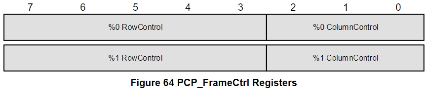

從上表可以看到，Row 數量共有 23 種設定值、Column 數量共有 8 種設定值，因此排列組合起來共有 `23x8=184` 種不同的 frame shapes；Frame Size 則是從最小 `48 x 2 = 96 (bits)` 到最大 `256 x 16 = 4096 (bits)`。

BitSlot 的位置可以用符號 `[<Row>, <Column>]` 來進行分辨，frame 的第一個 bit 為 `[0, 0]`，接下來為 `[0, 1]`, `[0, 2]`, ..., `[1, MaxCol]`, ..., `[MaxRow, 0]`, `[MaxRow, 1]`, ..., `[MaxRow, MaxCol]`。Figure 22 展示了同一組 BitSlots 的 Frame view 和 Bitstream view：

Frame shape 的設定會跟 bus clock 以及該 audio streams 的 audio sample rate 有關，以下舉兩個例子：
- 48kHz sample rate & 12.288MHz bus clock
  - $\frac{12.288MHz \times 2}{48KHz}=512(bits)$；這是由於 SoundWire 一個 clock cycle 可帶 2 bits data
  - 因此 frame shape 需要與 512 相關，例如：`64 x M`, `128 x M`, `256 x M`；其中 `M` 為 Column 數量
- 48kHz sample rate & 9.6MHz bus clock
  - $\frac{9.6MHz \times 2}{48KHz}=400(bits)$
  - 因此 frame shape 需要與 400 相關，例如：`50 x M`, `100 x M`, `200 x M`

Control Word
-------

在 Frame Structure 中，第一行 (`column 0`) 的前 48 個 bitslots 即為 Control Word，如 Figure 23 所示，而除了 column 0 以外的其他行都是 data payload。但由於 bitstream 會將 Frame 一列一列傳輸，因此從 Figure 22 你會看到 Control Word 在 bitstream 中是不連續的。

- 48 bits 的 Control Word 中又用被分成了兩種功能
  - Control BitSlot (20 bits) : 負責一些 low level 的功能，例如 Frame Synchronization。如下 Table 25。
  - Command BitSlot (28 bits) : 負責幫助當前的 command owner 傳送 command 給其他設備，也負責接收 respond 給 command owner
 

Control Word Fields
-------

#### PREQ (Ping Request) ####

這是由一個或多個 Slave 發出來的 Alert，用於請求 Comannd Owner 發送 Ping Frame 來讀取 Peripheral 當前的狀態資訊。此外，由於多個 Slave 的 data line 是 `Wire-OR` 關係，所以只有有其中一個 Slave 拉起 PREQ，Command Owner 收到的 PREQ 都會被拉起來。

而當 Command Owner 收到該 PREQ 後，會在接下來的 32 個 Frame 內發送 Ping Command 去讀取 Slave 狀態。一旦拉起了 PREQ，Slave 就會一直拉著直到成功收到來自 Owner 的 Ping Command。

每個設備都會回傳一個 2 bits 的 Status，如下 Table 63：

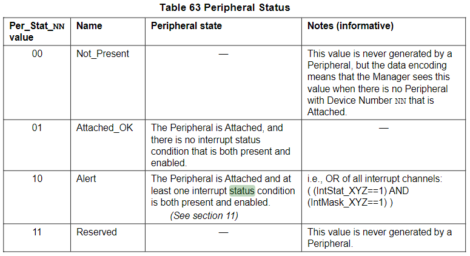

#### Opcode ####

Opcode 由 3 bits 組成，目前 SoundWire 定義的 Opcode 有以下三種，如 Table 27：

- Ping : 讓 Bus 上所有 Slave 都回傳狀態 (至多 11 個設備)
- Write : Commmand Owner 對一個或多個設備中的一個或多個 Register 寫一個 8 bits data
- Read : Commmand Owner 從一個或多個設備中的一個或多個 Register 讀一個 8 bits data

當 Opcode 為 Ping 時，對應的 command field 如下：

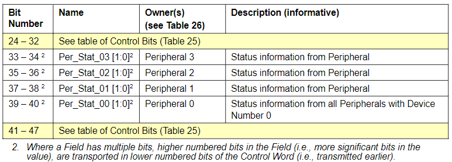
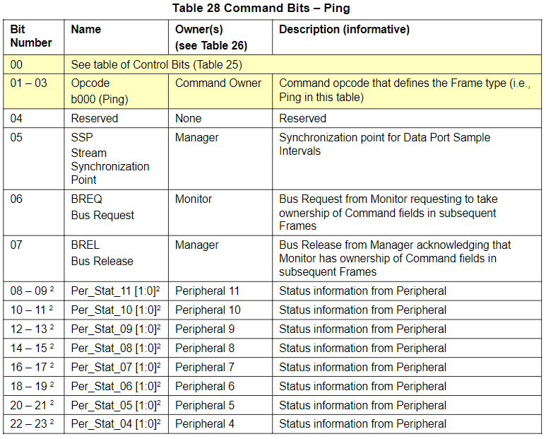

當 Opcode 為 Read/Write 時，對應的 command field 如下：

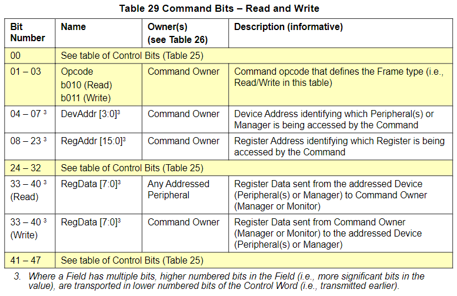

當 Opcode 為 Reserved 時，對應的 command field 如下：

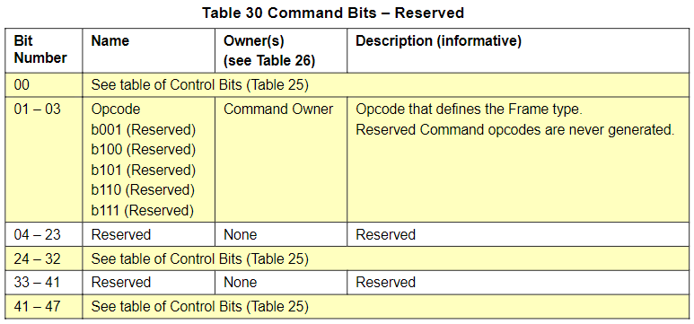

#### Static Synchronization ####

Static Synchronization 是一個固定的 8 bits value `b'10110001`，由 Master 產生並由 Slave 接收，以此來維持 Frame 的同步。

#### PHY Synchronization ####

PHY Synchronization 為 1 bit，由 Master 產生來通知 Slave 當前的 PHY 屬於什麼狀態，`0` 代表通的 PHY、`1` 代表 High-PHY。當 Slave 收到時就會把 PHY_Sync 值寫進對應的 Register。

#### Dynamic Synchronization ####

Dynamic Synchronization 為 4 bits，且為連續 15 個 Frame 的動態碼，如 Table 38。

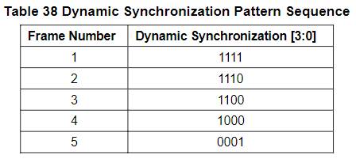
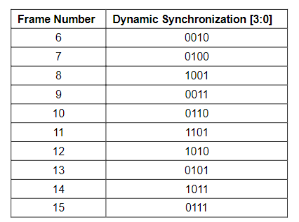

Peripheral 在透過 Static Synchronization 進行初次與 Master 的同步後，會再利用 Dynamic Synchronization 來檢查該同步是否符合預期。因此 Dynamic Synchronization 的目的就是用來降低 interface 對 bitstream 錯誤鎖定的機率。(Bitstream 中的 payload data bitslots 的靜態值有一定機率出現與 8 位元 static synchronization 欄位相同的位元值。)

Dynamic Synchronization 值來自 4 bits LFSR (Linear Feedback Shift Register) 暫存器，其通過一個 PRBS (Pseudo-random Binary Sequence) 所產生出來的，而 LFSR 的初始值為 `b'1111`，Figure 26 為 LFSR 生成動態同步碼的 Pattern。

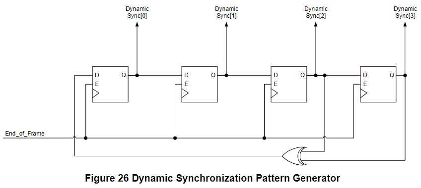

#### Parity Check (PAR) ###

Control Word 中有 1 bit 的奇偶校驗位，用來檢測數據傳輸過程中是否出現錯誤。**但請注意奇偶校驗的是 data 電平的高低次數而不是 Logic 0 or 1 的次數。**

PAR 是由 Command Owner 經計算後產生的，會跟著 Control Word 發送到別的設備進行校驗，倘若設備計算出來的 PAR 與 Command Owner 不一致則可能引發中斷 (如果這時有 enable interrupt 的話)，並且會發送一個 `Command_Failed` 的 response，讓該 bus 上所有設備都丟棄這一個 Frame。

奇偶校驗的 window 會超過一個 frame 的邊界 (超出多少則取決於 row 數)，也就是說一個奇偶校驗的 window 中會同時包含上一個 frame structure 的部分 bitslot 以及當前 frame structure 的部分 bitslot，因此做奇偶校驗時也會需要上一個 frame 的 bitslot，可以參考 Figure 24/25。

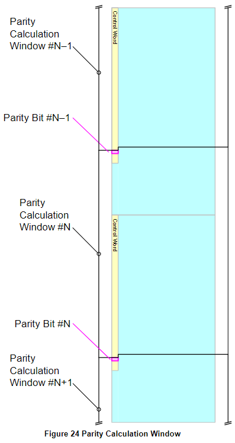
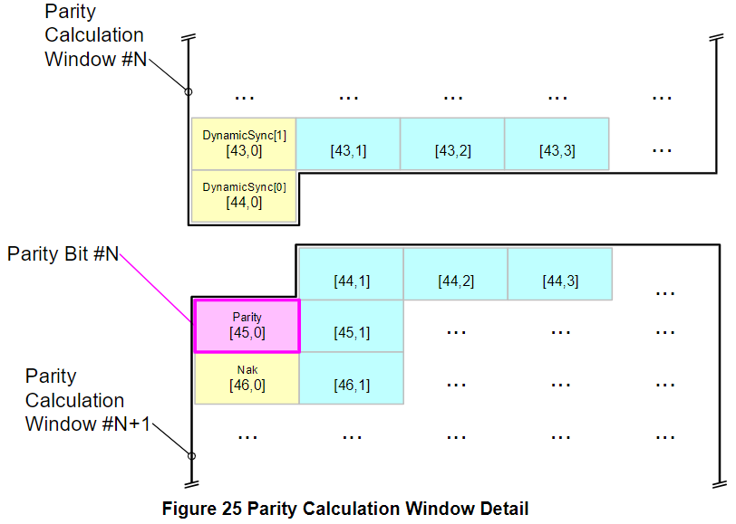

#### NAK and ACK ####

Control Word 中有 NAK 和 ACK 用來描述對 Command 的 Response。

當有一個設備被選中是 command 的目標時，其 response 的 NAK & ACK 組合可能如下：

|  Response | NAK | ACK | Remark |
| --- | --- | --- | --- |
| `Command_Failed` | 1 | 0 | 例如奇偶校驗失敗 |
| `Command_OK` | 0 | 1 | 例如順利完成 Read/Write 操作 |
| `Command_Ignored` | 0 | 0 | 例如讀了一個 Write-only Register |

當有一個設備**沒有**被選中是 command 的目標時，其 response 的 NAK & ACK 組合可能如下：

|  Response | NAK | ACK | Remark |
| --- | --- | --- | --- |
| `Command_Failed` | 1 | 0 | 例如奇偶校驗失敗 |
| `Command_Ignored` | 0 | 0 | 例如自己並不是 Read/Write 操作的目標設備 |

Command Fields
-------

#### Stream Synchronization Points (SSP) ####

SSP 為 1 bit，用於設備間的傳輸同步。當一個設備中出現了不同的 sample rate，且 sample rate 之間又不是呈倍數關係，那麼就需要用到 SSP 來使 sample rate 和 frame 同步。

#### Bus Request (BREQ) ####

BREQ 為 1 bit，Monitor 可以透過拉 BREQ 來請求成為 Command Owner。

#### Bus Release (BREL) ####

BREL 為 1 bit，Master 可以透過拉 BREL 來允許 Monitor 成為 Command Owner。

#### Slave Status (Slv_Stat_nn) ####

一共包含了 12 個 Periphral 的狀態，每個 Peripheral 佔 2 bits，一共 24 bits。可以參考 Table 27。

#### Device Address (DevAddr), Register Address (RegAddr), Register Data (RegData) ####

- DevAddr 佔 4 bits
- RegAddr 佔 16 bits
- RegData 佔 8 bits
