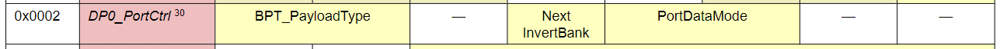

Commands
======

Commands 是 Control Word 的一部分，其包含了 Ping, Read, Write 操作。

Register Bank Switching
-------

可以先配置好一系列的參數 for 特定的 bank (bank 0 or 1)，切換 bank 之後就可以在下一個 Frame 就馬上套用所有參數 (其中包含 Frame Shape)

#### Bank Selection ####

對 PCP_FrameCtrl0 (0x0060) 寫值就會切換到 Bank0；對 PCP_FrameCtrl1 (0x0070) 寫值就會切換到 Bank1。切換到新的 Bank 後，其所有新的參數設定 (包含 Frame Shape 和 Data Port Registers) 會在下一個 Frame 開始採用。

#### Frame Shape Change ####

Device Register `SCP_FrameCtrl` 用來存放 Frame Shape 的 Row/Column 資訊，如 Figure 64：

- 記憶體位址
    - `0x0060` : PCP_FrameCtrl0 Register (for bank 0)
    - `0x0070` : PCP_FrameCtrl1 Register (for bank 1)

> Master 可能會在列舉後用 Device Number 12, 13, 15 快速設定所有 Slave 的 Frame Shape。

#### CurrentBank_DPx and NextInvertBank ####

每個 Data Port 都有自己的 CurrentBank 狀態，稱為 `CurrentBank_DPx`。這個狀態只會影響到自身 Data Port 的傳輸，並不會影響到整個 Slave 的傳輸 (例如 FrameStructure)。

如下圖所示，每個 Data Port 的 `0x0002` `DP_PortCtrl` 裡面的 `Next InvertBank` 欄位可以單獨讓該 Data Port 在下一個 Frame 切換到另一個 Bank 的設定。

Stream Synchronization Points (SSPs)
-------

不同的 data port 可能會用不同的 sample interval 在運作，但如果有個 Point 是所有 data port counter 都為 0，那就代表雖然每個 data port 的 sample interval 都不一樣大小，但他們有一個最小公倍數。

SoundWire 有個機制可以指定特定的 clock edge，該 edge 就是 Stream Synchronization Points (SSPs)，在 SSP 時所有的 sample interval counters 都會強制設為 0，讓不同的 Sample Interval 也能保持同步。

Payload 的傳輸和取樣是通過 Data Port 內部的 Counter 測量 bitslot interval 來進行的。為了保證傳輸的正確性，傳輸端與接收端的 Data Port，兩端的 Counter 必須要同步，此時就需要 SSP 的幫忙了。

SSP interval 的大小為所有目前正在使用之 sample interval 的最小公倍數，一旦 sample interval counter 被一個 SSP 強制歸零後，未來再次強制清零的操作不會擾亂其計數週期。

- Master 有以下兩種方式可以產生 SSP，
    - 使用 Ping Control Word，並且將 SSP bit (bit 5) 設成 1
    - 存取 `SCP_FrameCtrl0` or `SCP_FrameCtrl1` Register

> 規格書有規範每 `100ms` 至少要送一次 SSP。

SSP 一般出現在 Frame 的邊界。例如上一個 Frame 結束時 (BitSlot[MaxRol, MaxCol]) 或下一個 Frame 開始時 (BitSlot[0, 0])。

> 當系統中有一個或多個 DP 從 Channel 傳輸 payload stream 時，manager 應僅在與前一個 SSP 相隔 payload data interval 之倍數 Point 處來指示 SSP

#### Generating SSPs in Systems with Peripheral to Peripheral Payload Transport ####

在 peripheral-to-peripheral payload transport stream 的系統中，manager 無法通過其自身的 DP 直接看到 Sample Interval，它可能會通過以下方式來指示 SSP 的正確相位：
- 在 manager 中配置一個 DP 來傳輸 **“dummy”** payload data，其 sample interval 是這些外部 sample interval（peripheral-to-peripheral）的整數倍，以此將與它們保持相位同步
- 使用與外部 sample interval 之整數倍的 frame interval（因為指示 SSP 事件的機制都與 frame 的邊界對齊）
- Manager 所在的 component 內的其他內部自定義的周期事件，這些事件將與這些外部 sample interval 保持相位同步

Atomic Access Mechanism for Multi-Byte Quantities (MBQs)
-------

這個機制讓我們可以用 single-byte Write/Read Command 來 access multi-byte quantities，此機制被定義在 SDCA 裡面。

> MBQ 指的就是一個由多個 bytes 組成的 value，而此機制就是為了想要一次讀出或寫入這個 value 的所有 bytes。

這個機制使用一個 multi-byte holding buffer 先儲存讀進來的資料 (或是要寫出去的資料)。軟體會先假設 Device 的所有 MBQs 都共用同一個 holding buffer (甚至連 read/write 操作都用同一個 buffer)。因此存取多個 MBQs 時要用 `serial` 的方式，而不是用 `interveal` 的方式。

跟一般存取 single-byte register 的手法類似，Manager 也需要對 MBQs 做多次 register access。舉例來說，假設要執行連續兩組 4 single-bytes write，那就會先把兩組 32 bits values 搬到 holding register，然後再做 MBQ update。

每個 MBQ Register 都有兩組 Address，這兩組 Address 通常只會有一個 address bit 不同 (例如 `0xC3D0` & `0xD3D0`)，不同的那個 bit 就叫做 `nMBQ_Atomic` control bit，SDCA Spec 會定義哪個 bit 要當成 `nMBQ_Atomic` control bit。

此外，MBQ 的 read write，其 Data 的排序是相反的 (byte endianness)。

#### Read MBQs 流程 ####

1. 使用 Read Command 讀取 MBQ_address 會執行 atomic "data capture"，第一次讀取時得到的 RegData 是 MBQ 的 LSB
    - 這邊的 Data Capture 意思就是先把 MBQ value 存到 MBQ Read Buffer
2. 將 `nMBQ_Atomic` address bit 加 1，使用 Read Command 讀取相同的 MBQ_address，讀取得到的 RegData 就是 MBQ 的下一個 Byte
3. 接下來不需要動 `nMBQ_Atomic` address bit，使用 Read Command 讀取相同的 MBQ_address，讀取得到的 RegData 就是 MBQ 的再下一個 Byte，直到讀完整個 MBQ
4. 重複步驟 3，一直讀 MBQ_address 直到讀完整個 MBQ
5. 完成

> MBQ 的讀取順序是 LSB->MSB

下圖是一個範例，目的是去讀一個位址從 `0xC3D3`~`0xC3D0` 且值為 `0x12345678` 的暫存器，可以比較一般去讀 4 個 1-byte registers 以及讀 4-byte MBQ 的差異：

> 假設有指定 MBQ_address 的 bit 12 為 `nMBQ_Atomic` address bit。

#### Write MBQs 流程 ####

1. 先將 `nMBQ_Atomic` address bit 加 1，使用 Write Command 對 MBQ_address 寫值，先從整個 value 的 MSB 開始寫，值也同樣會被寫到 MBQ Write Buffer
2. 繼續使用 Write Command 對 MBQ_address 寫值，值會被寫到 MBQ Write Buffer
3. 要寫最後一個 byte 前，要先將 `nMBQ_Atomic` address bit 減 1 再用 Write Command 寫最後一個 byte，此時同時會執行 atomic update，將整個 MBQ Write Buffer 更新到 MBQ Register

> MBQ 的寫入順序是 MSB->LSB

下圖是一個範例，目的是將值 `0x12345678` 寫到位址從 `0xC3D3`~`0xC3D0` 的暫存器，可以比較一般去寫 4 個 1-byte registers 以及寫 4-byte MBQ 的差異：

