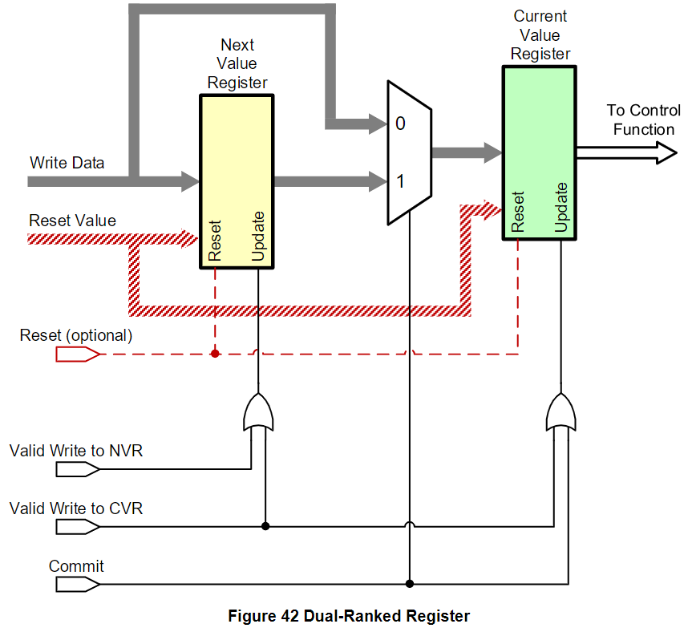

Registers
=======

Multi-Byte Quantities (MBQ) Registers
-------

MBQ 用來對 Device 做 multi-byte access，並且可以一次 update 一個 MBQ 中的所有 bytes。這個 MBQ 機制被定義在 SDCA 規格書裡面。而 MBQs 機制也可以跟 Dual-Ranked 一起使用，讓 Dual-Ranked Register 也可以做 MBQs value update。

MBQ 的大小可以是 16 ~ 64 bytes，而通常都只會用到 16/32 bytes 的 MBQ Read/Write。

Register Summary
-------

How to Paging Register
-------

**Case 1 : 有 Implement PCP_AddrPage1&2 Register**

1. 使用 16A8D Write Command 寫入 0x0048 & 0x0049
2. 接著使用 16A8D Access，可以組合出 31 Bits Address 進行操作 

> 要使用 Paging 的話，要把 16A 的 bit 15 設為 1

**Case 2 : 沒有 Implement PCP_AddrPage1&2 Register**

1. 僅能使用 16A8D Command Access 15 bits address range

Dual-Ranked Registers
-------

為了可以先準備好所有暫存器，全部設定完後再一起 Update，因而定義了 Dual-Ranked Registers，而 Dual-Ranked Registers 定義在 SDCA Spec。

這個機制跟 Banked Register 是不一樣的，Banked Register 的目的是維護兩套完整的值，然後透過切換 Bank 來瞬間套用不同的 Payload Transport 設定。而 Dual-Ranked Register 通常用在需要同時更新的 Audio Controls Sets (例如濾波器中的幾個參數，或兩個不同放大器中的 Gain)。

Dual-Ranked Register 裡面有 Device 目前運作的 Current Value Register (CVR) 和之後欲切換的 Next Value Register (NVR)。可以用 Commit Operation 把值從 NVR 複製到 CVR，要注意複製過去後 NVR 的值並不會被砍掉。

16A8D 示範
-------

示範使用 16 bits addressing 來對 Device 讀寫 8 bits data。

