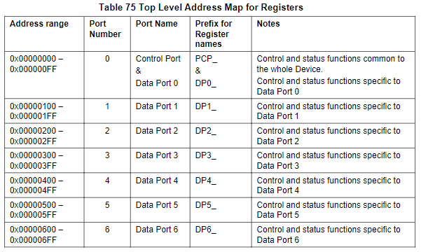
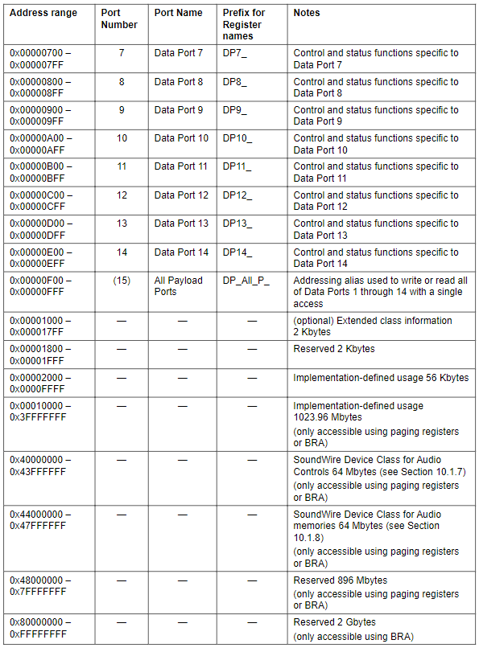
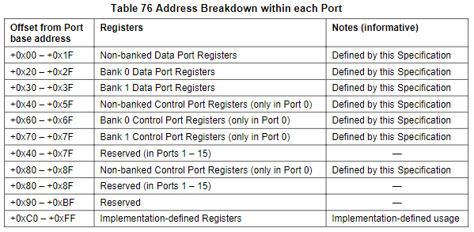
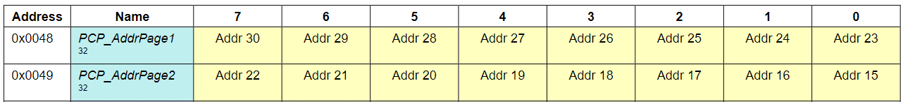
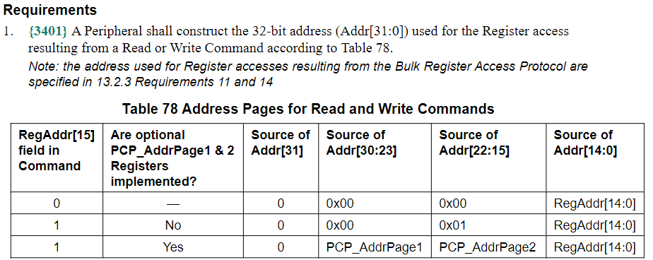

Registers
=======

Multi-Byte Quantities (MBQ) Registers
-------

可能有些寫到 Device 的值或從 Device 讀出來的值是 multi-byte quantities (一個值由很多個 bytes 組成)，並且希望可以同時 update 一個值的所有 bytes。規格書中描述了一個機制可以執行這些 MBQs 的 atomic update，而這項機制被部署在 SoundWire Device Class for Audio (SDCA) 裡面。

> SoundWire Spec 中講述，Designer 也可以使用自己定義的 MBQ Registers 來實作 (不一定要用 SDCA 裡面定義的？)。

MBQs 讀取機制是用來補充 Dual-Ranked Registers 的機制，可以把預先準備好的 MBQs value 一次直接全部提交更新。MBQs 機制可以跟 Dual-Ranked 一起部署，以提供 Dual-Ranked Registers 中之 MBQs 值的更新。

SoundWire 規格書沒有定義 MBQs 的 Size 要多大，每個 MBQ 的 Size 都可以自己自行定義。因此，要嘛使用 SDCA 裡面定義的 MBQs，要嘛由 Designer 自己定義。

Register Summary
-------

How to Paging Register
-------

**Case 1 : 有 Implement PCP_AddrPage1&2 Register**

1. 使用 16A8D Write Command 寫入 0x0048 & 0x0049
2. 接著使用 16A8D Access，可以組合出 31 Bits Address 進行操作 

> 注意 16A bit15 不會被計算到 Address 內，取而代之的是 PCP_AddrPage1&2 (mapping to actual Addr[30:15])

**Case 2 : 沒有 Implement PCP_AddrPage1&2 Register**

1. 僅能使用 16A8D Command Access 15 bits address range

